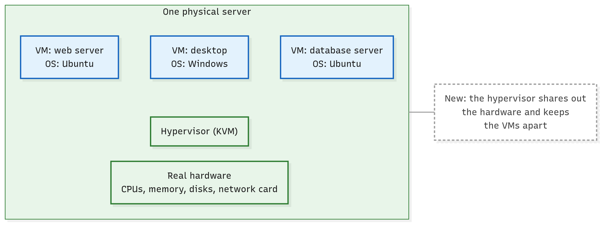
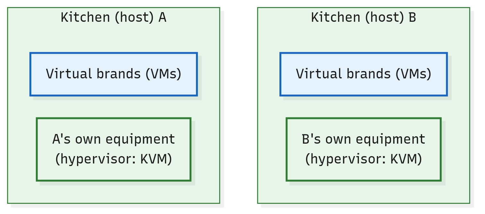

# What Is a Virtual Machine, and What Runs It?

**Level:** Beginner · **Type:** Concept · **Written against:** commit `1a48a87587` · **Reading time:** about 10 minutes

Everyone says a cloud gives you virtual machines.

Ask a cloud for one, and you get something you can use like a server of your own. It boots its own operating system, runs your programs and shows up on the network as a machine of its own.

Yet nobody plugged in a new computer for you.

So what did you get, physically? And where is it running?

This course is about Apache CloudStack: software that builds such a cloud out of many real servers. Before CloudStack can make sense, you need the thing it hands out: the virtual machine.

## What you'll learn

- What a virtual machine is, and the problem it solves.
- What a hypervisor does, and where it runs.
- Why a VM is more than a process, and how it differs from a container.
- What CloudStack means by a host, and by an Instance.
- Why "a cloud of ten hosts runs one hypervisor" is wrong.

## One server, three computers

Start with one real server in a data centre. Like any computer, it has CPUs, memory, disks and a network card.

Three jobs need a home: a web server on Ubuntu, a Windows desktop, and a database server on Ubuntu.

Put all three straight onto the server, and they share its one operating system. That's how organisations used to work, and [it caused trouble](https://kubernetes.io/docs/concepts/overview/): one application could take most of the resources while the others underperformed.

And one operating system can't be Ubuntu and Windows at once.

Give each job a server of its own instead, and you get the opposite problem: the servers sit underused, and they're expensive to keep.

The way out is to turn the one server into several computers made of software.

A **virtual machine (VM)** is a complete computer made of software, running on a real one. It has three layers:

- virtual hardware: CPUs, memory, disks and network cards, which software presents to the VM as if they were its own;
- its own operating system, called the guest OS;
- its own programs.

NIST, the US government's standards body, defines it in [one line](https://csrc.nist.gov/glossary/term/virtual_machine) in its glossary: "A software-defined complete execution stack consisting of virtualized hardware, operating system (guest OS), and applications."

So the server now holds three VMs, each a computer in its own right. The desktop runs Windows while the other two run Ubuntu, side by side on the same hardware.

Each VM even has its own network card (or several), so on the network the three look like three separate computers.


*Click the picture to enlarge it.*

One physical server, three VMs, each with its own operating system. In these pictures, a box drawn above another runs on it. A dashed box is a note, tied by a thin grey line to what it's about.

## A hypervisor shares out the real machine

Three operating systems, one set of real hardware. Who decides which VM gets a CPU right now? And who stops one VM from getting at another's data?

That's the job of the **hypervisor**: the software on a computer that shares out its real CPU, memory and devices among the VMs, and keeps them apart.

Each VM sees what looks like a whole computer. Behind the scenes, the hypervisor hands it a share of the real one.



*Click the picture to enlarge it.*

The hypervisor sits between the real hardware and the VMs.

"Apart" is strong, but it isn't absolute. One VM can't freely get at another's information, yet NIST still publishes a [whole guide](https://csrc.nist.gov/pubs/sp/800/125/final) to the security concerns of virtualisation.

Linux has a hypervisor built in: KVM, short for Kernel-based Virtual Machine. It's the hypervisor this course uses.

Its core is part of the Linux kernel itself. The kernel is the heart of the operating system: it manages the hardware and every running program. KVM comes as kernel modules, add-on pieces loaded into the kernel while it runs, the kind `lsmod` lists.

So a KVM server is an ordinary Linux machine whose kernel also runs VMs.

What does it take, and what does it cost?

- KVM needs help from the processor: extensions built into it for running VMs, called hardware virtualisation (Intel VT-x or AMD-V), switched on.
- Every VM on a server shares that server's real hardware, so one server holds only so many VMs.

## A VM is more than a process

So the server's kernel runs VMs, just as it runs your programs. Isn't a VM just another process, then?

You know processes. Your browser and your editor are processes, and both run on your machine's one kernel. Whenever they need memory, a file or the network, they ask that kernel.

A VM is different. Inside it runs a whole operating system, with its own kernel, on its virtual hardware. The programs inside a VM ask the VM's own kernel.

Here's the twist. Seen from the server, on KVM, each running VM does show up as one process. One of CloudStack's own scripts finds VMs by searching the server's process list, with the same `ps` you know.

So a VM isn't *just* a process. It's one process on the outside, and a whole computer on the inside.

And containers? A container keeps an application apart from the others too, but every container on a machine shares that machine's one kernel ([NIST](https://csrc.nist.gov/glossary/term/application_virtualization)). A VM brings its own.

That's the trade-off between them. A container is lighter, because it carries no kernel of its own: it borrows the machine's.

A VM is heavier, because it carries a whole operating system, kernel included. In exchange, it can run a different operating system from the server's (Windows on a Linux server, say), and it's kept further apart from its neighbours.


*Click the picture to enlarge it.*

Processes and containers share one kernel; each VM runs its own, even though the server sees it as one process.

## CloudStack's words: host and Instance

CloudStack has a word for the server underneath the VMs. A **host** is a single computer that runs VMs, with its own hypervisor installed on it. It's normally a physical server in a data centre.

That's narrower than the "host" of `hostname` or `/etc/hosts`, where any machine on a network is a host. In CloudStack, a host is a computer whose job is to run VMs.

CloudStack's [docs](https://docs.cloudstack.apache.org/en/4.22.1.1/conceptsandterminology/concepts.html#about-hosts) put it in three sentences:

> A host is a single computer. Hosts provide the computing resources that run Guest Instances. Each host has hypervisor software installed on it to manage the Guest Instances.

"Guest" is the VM seen from the machine that runs it: a host hosts its guests.

> [!TIP]
> **Kubernetes lens:** In Kubernetes, the machine where the work runs is a [node](https://kubernetes.io/docs/concepts/architecture/nodes/), much like a host here. A node isn't always a physical server: in the Kubernetes docs' words, "A node may be a virtual or physical machine, depending on the cluster."
>
> For this comparison, picture a node as a physical server, like a host. The difference is what runs on it: containers on a node share the node's kernel, while each VM on a host brings its own. (This lens has nothing to do with CloudStack's own Kubernetes Service, which runs Kubernetes on CloudStack VMs.)

So where does a VM run? On one host at a time. CloudStack's record of a running VM names exactly one host: the one it's on now.

The people who use a cloud never see its hosts; the team that runs it does. In the docs' words, "An end user cannot determine which host their guest has been assigned to." The reason comes [later in this module](09.Zones-And-Pods.md) *(coming soon)*.

And the "Instances" you'll meet in CloudStack's web pages? They're VMs too: CloudStack's web interface calls a VM an Instance.

It's only the word on the screen. Underneath, CloudStack's code still says "virtual machine": one thing, two names.

## The picture: virtual brands in a shared kitchen

This course carries one picture with it, and it starts here.

Order dinner on a delivery app, and the restaurant you pick may have no dining room and no kitchen of its own. It's a **virtual brand**: a name, a menu and recipes, whose meals are cooked at a station in a shared kitchen. Other brands cook beside it, each at its own station, and none of them can reach into another's.

That's a VM. It looks like a computer of its own, but it runs on a shared machine.

The **kitchen** is the one real place whose burners and counter space the brands share. It's the host, and its burners and counter space are the host's CPU and memory.

Each kitchen has its own equipment, which gives every brand a private station and shares out the burners. That equipment is the hypervisor.


*Click the picture to enlarge it.*

The same server as a kitchen: three virtual brands, each at its own station.

A brand isn't a single meal: it keeps cooking for as long as its owner keeps it open. A VM, likewise, runs for as long as someone needs it, months if need be.

One warning about the picture: equipment sounds like hardware. A hypervisor is software, and on KVM its core is part of the host's own kernel.

## Every host runs its own hypervisor

Now add a second host. Does it share the first host's hypervisor?

No. A hypervisor shares out the hardware of the machine it runs on, and nothing else, so every host needs its own.

The docs said it already: each host has hypervisor software installed on it. On KVM it's plainer still: the hypervisor's core sits in each host's own kernel.

CloudStack keeps track host by host. Its record of each host lists that host's own CPUs, memory and hypervisor, with the hypervisor's version, as reported for that host. Two hosts can report two different versions.

So a cloud of ten hosts runs ten hypervisors, one on each. In the picture: each kitchen has its own equipment.



*Click the picture to enlarge it.*

Two hosts, two hypervisors: no hypervisor spans hosts.

## Try it in your lab (optional)

Nothing here is needed to follow the course. But if you're curious whether your own Ubuntu machine could run KVM, two checks from the docs tell you.

First, see whether the KVM modules are loaded. CloudStack's [Quick Installation Guide](https://docs.cloudstack.apache.org/en/4.22.1.1/quickinstallationguide/qig.html) uses this command, and says you should see the `kvm` module listed with its Intel or AMD partner:

```sh
lsmod | grep kvm
```

Second, Ubuntu's own check, from the [Ubuntu Server docs](https://ubuntu.com/server/docs/how-to/virtualisation/libvirt/). It isn't installed by default; it comes in the `cpu-checker` package:

```sh
sudo apt install cpu-checker
kvm-ok
```

It prints a message saying whether your CPU supports hardware virtualisation. If the answer is no, the feature may just be switched off: on many computers it's an option in the BIOS settings.

And if your machine is itself a VM, [What Does One Machine Need to Run CloudStack?](15.Lab-Preparing-A-Machine.md) *(coming soon)* shows what it needs.

## In short

- A virtual machine (VM) is a complete computer made of software: virtual hardware, its own operating system and its own programs. It runs on a real computer.
- A hypervisor is the software that shares out a computer's real CPU, memory and devices among its VMs, and keeps them apart. Linux has one built in, KVM, whose core is part of the kernel.
- A VM is more than a process: on KVM, its host sees it as one process, but inside it runs its own kernel. Containers share their machine's kernel; VMs don't.
- CloudStack calls a computer that runs VMs a host. The people who use a cloud never see its hosts, and CloudStack's web interface calls VMs Instances.
- Every host runs its own hypervisor: ten hosts, ten hypervisors. In the course's picture, VMs are virtual brands, and hosts are kitchens, each with its own equipment.

## Check yourself

1. Your laptop runs a web browser as a process. A KVM host runs an Ubuntu VM, which also shows up there as a process. What does the VM have that the browser doesn't?
2. What does a hypervisor do, and where does it run? Where is it on a KVM host?
3. True or false: "a cloud of ten hosts runs one hypervisor." If it's false, correct it.
4. Why does the course's picture say *virtual* brand, and not just restaurant?

[Check your answers →](99.Check-Yourself-Answers/01.Virtual-Machines.md)

## Further reading

- [About Hosts](https://docs.cloudstack.apache.org/en/4.22.1.1/conceptsandterminology/concepts.html#about-hosts), in CloudStack's Concepts and Terminology: the docs' own definition of a host, and of the hypervisor on each one.
- [Historical context for Kubernetes](https://kubernetes.io/docs/concepts/overview/): physical servers, VMs and containers, in five short paragraphs.
- NIST's glossary entries for a [virtual machine](https://csrc.nist.gov/glossary/term/virtual_machine) and a [hypervisor](https://csrc.nist.gov/glossary/term/hypervisor).
- [NIST SP 800-125](https://csrc.nist.gov/pubs/sp/800/125/final): virtualisation and its security concerns, in depth.

---

**Next up:** [How Does a Hypervisor Work?](02.Hypervisors.md) Several operating systems share one processor, each sure it owns the machine. How does the hypervisor pull that off, and what is the one process each VM shows up as?
