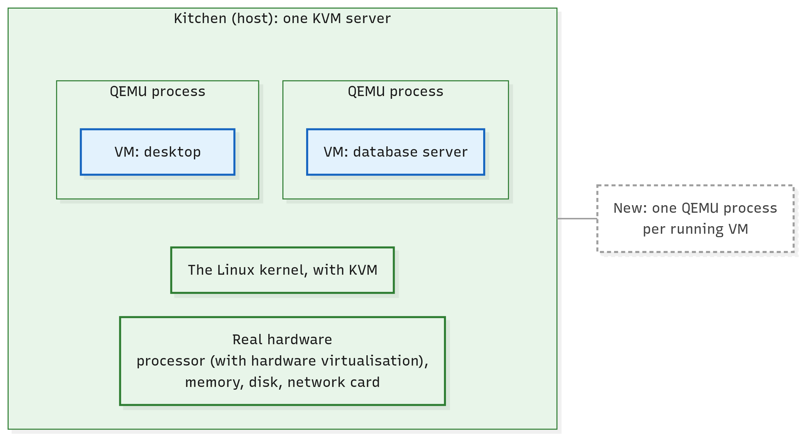
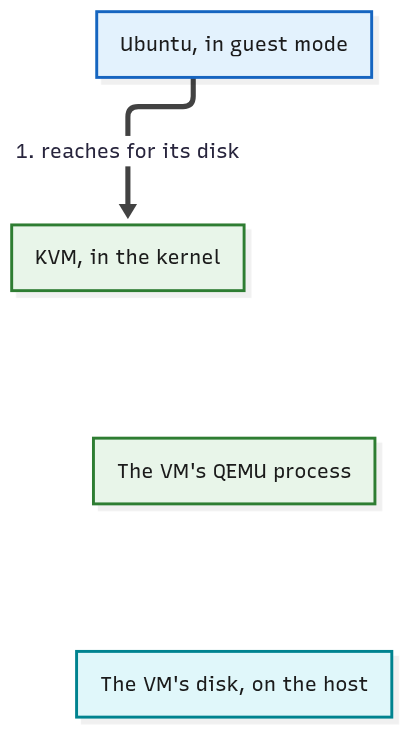
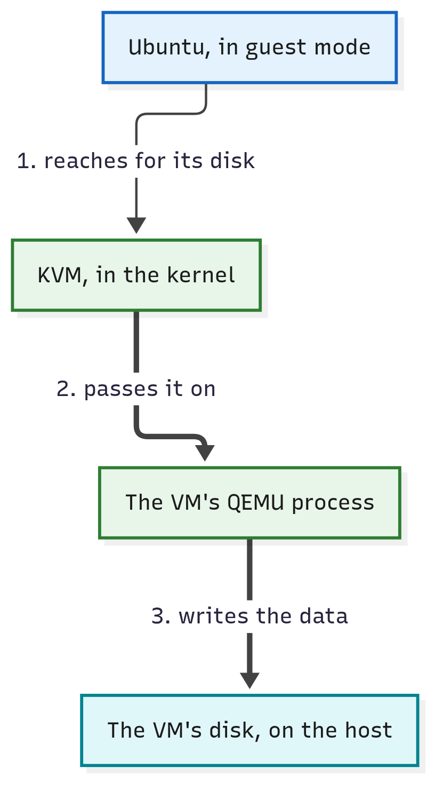
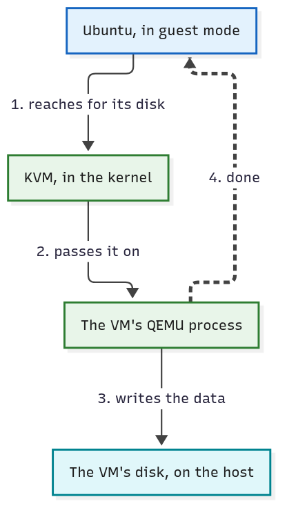

# How Does a Hypervisor Work?

**Level:** Beginner · **Type:** Concept · **Written against:** commit `1a48a87587` · **Reading time:** about 15 minutes

On your laptop, one kernel is in charge. Your programs ask it for memory, files and the network, and only the kernel commands the hardware directly.

Inside a VM, Ubuntu's kernel is built the same way: it expects to be in charge of the machine.

The [first article](01.Virtual-Machines.md) put three VMs on one server: three kernels, each built to command the hardware, on one real machine. The hypervisor makes that work. But how?

And on KVM, each running VM shows up on the server as one process. What is that process? Is every hypervisor built like that?

## What you'll learn

- Why several operating systems can't simply share one machine, and how the processor's hardware virtualisation lets them.
- What each part of the hypervisor does on a KVM host: KVM in the kernel, one QEMU process per VM, and libvirt.
- What happens when a VM starts, and when it writes to its disk.
- How type 1 and type 2 hypervisors differ, and where KVM fits.

## A hypervisor is several parts, each with a job

In the first article, the hypervisor was one box between the hardware and the VMs: in the course's picture, the kitchen's equipment. Let's open the equipment up.

[NIST](https://csrc.nist.gov/pubs/sp/800/125/a/r1/final), the US standards body you met in the first article, calls the hypervisor platform "a collection of software modules". It splits the work three ways:

- a core gives the VMs their processors and memory;
- other pieces give them devices, such as disks and network cards;
- management pieces start and stop VMs.

On a KVM host, each job has a part of its own, and the processor itself helps too. You'll meet them in the order a VM needs them.


*Click the picture to enlarge it.*

The equipment opened: its core, KVM, sits in the host's kernel.

The kitchen picture stops here: nothing in a kitchen is like the processor's own help, or a process for each brand. From now on, the real parts carry the article.

We'll follow one VM through it all: the Ubuntu web server from the first article, stopped for now.

## Every operating system expects to be in charge

Start with the problem.

Some operations are privileged: only the part in charge of the machine may do them, such as talking to a disk or deciding which memory belongs to whom. On your laptop, programs never do them. They ask the kernel, and the kernel does.

Inside a VM, Ubuntu's kernel is still a kernel, written to do those operations itself.

Now put three kernels on one server. If each really did its privileged operations, all three would command the same disk and the same memory, and nothing would keep the VMs apart.

So the hypervisor has to stay in charge. [NIST](https://csrc.nist.gov/pubs/sp/800/125/a/r1/final) compares it to the kernel you know: it keeps VMs apart, just as an operating system keeps its processes apart.

But a guest's kernel gives those commands itself, as it would on a real machine. It doesn't ask; it acts.

Without help, one way out is for the hypervisor to find the guests' instructions (the basic steps a processor carries out) that touch the machine itself, and rewrite them in software: "binary translation", in [NIST's](https://csrc.nist.gov/pubs/sp/800/125/a/r1/final) words. That's extra code running with full privileges, and the less of it there is, the easier it is to check.

There's a better way, built into the processor.

## The processor's help: hardware virtualisation

**Hardware virtualisation** is a set of features built into the processor itself (Intel's VT-x, AMD's AMD-V) that let it run a VM's own code directly while the hypervisor stays in charge.

Here's the trick. The processor gets a second, restricted mode for VMs, called guest mode. The hypervisor runs in the processor's more powerful mode, and a VM's code, kernel and programs alike, runs in guest mode.

Inside guest mode, Ubuntu's kernel still runs at a kernel's usual level of privilege, and its programs at theirs, just as on a real machine. Its code runs straight on the real processor, with nothing translating it.

When the guest reaches for something only the hypervisor may touch, such as a device, the processor stops the guest and hands control to the hypervisor. The hypervisor deals with it and lets the guest carry on.


*Click the picture to enlarge it.*

The guest runs straight on the processor until it reaches for the real machine; then the processor hands over.

In this picture and the ones below, solid arrows are requests and instructions.

The processor helps with memory too. It translates each VM's idea of its memory, in hardware, into places in the host's real memory. That's how the hypervisor, with the processor's help, keeps each VM's memory separate.

So what does all this spare the hypervisor? The rewriting. It has nothing to translate, so less of its code runs with full privileges.

And an unchanged operating system runs in a VM, with its usual drivers (the parts of an operating system that talk to devices).

The cost: every hand-over takes time. [NIST](https://nvlpubs.nist.gov/nistpubs/ir/2019/NIST.IR.8221.pdf) calls these switches "the main cause of performance degradation in a virtualized system". Only some operations cause one.

It's a common misconception that a hypervisor runs each VM's instructions one by one, like an emulator (a program that imitates a processor in software). With hardware virtualisation, the processor runs them.

Nor is hardware virtualisation software you install. It's in the processor, and it may need switching on in the BIOS settings, as the first article's [lab section](01.Virtual-Machines.md#try-it-in-your-lab-optional) said.

KVM depends on it: "For Intel and AMD hardware, KVM requires virtualization extensions in order to run," say [Ubuntu's docs](https://ubuntu.com/server/docs/explanation/virtualisation/vm-tools-in-the-ubuntu-space/). So CloudStack checks every KVM host for it: when a host is added, CloudStack's setup on that machine stops if KVM can't run there. On Ubuntu it uses the same `kvm-ok` check as the first article's [lab section](01.Virtual-Machines.md#try-it-in-your-lab-optional) (the code is on the answers page).

## KVM runs the VMs' processors

On a KVM host, which part of the hypervisor takes over when the processor hands control back? KVM: the kernel modules you met in the [first article](01.Virtual-Machines.md#a-hypervisor-shares-out-the-real-machine).

KVM's job is the VM's processors. A VM sees one or more CPUs of its own, its virtual processors. To run one, KVM switches the real processor into guest mode, lets the VM's code run, and takes control back at each hand-over.

With the processor's help, KVM also keeps each VM's memory separate.

A host has only so many real processors, though. Who decides which VM's virtual processor runs now? The same Linux kernel that shares the processor among your programs.

On KVM, in [NIST's](https://nvlpubs.nist.gov/nistpubs/ir/2019/NIST.IR.8221.pdf) words, VMs "run as normal Linux processes", so the kernel shares the real processors among them and your other programs alike.

What KVM doesn't give the VM is its disks and network cards. [NIST](https://csrc.nist.gov/pubs/sp/800/125/a/r1/final) draws the same line for hypervisors in general: processors and memory directly, devices through other "software modules". So who gives the VM a disk and a network card?

## QEMU plays each VM's hardware

A guest operating system expects real-looking hardware that its drivers know how to talk to: a disk controller, a network card, a graphics card. KVM provides none of these.

**QEMU** is the program that plays them. On a KVM host, it gives each VM virtual disks, network cards and the rest of a PC: devices the guest's drivers recognise. It makes them work with the host's real ones.

Its name is short for Quick Emulator: it imitates hardware in software. Its [manual](https://manpages.ubuntu.com/manpages/noble/man1/qemu-system-x86_64.1.html) lists the PC parts it imitates, from disk controllers to network adapters.

Here's the answer to the first article's puzzle. On a KVM host, each running VM is one QEMU process. CloudStack's own script finds VMs exactly that way ([kvmheartbeat.sh, lines 75–78](https://github.com/apache/cloudstack/blob/1a48a87587c03472feefb081cfac71b2ebd0f407/scripts/vm/hypervisor/kvm/kvmheartbeat.sh#L75-L78)):

```bash
# cloudstack: scripts/vm/hypervisor/kvm/kvmheartbeat.sh, lines 75–78
#delete VMs on this mountpoint
deleteVMs() {
  local mountPoint=$1
  vmPids=$(ps aux | grep qemu | grep "$mountPoint" | awk '{print $2}' 2> /dev/null)
```

The last line lists every process on the host and keeps the ones that mention `qemu`. It then narrows them to the VMs whose disks are on one storage mount, and takes each one's process number: one number per running VM. (The script stops those VMs when their storage has dropped away; why is a story for later.)

A stopped VM has no process at all. Our web server VM, still stopped, has none yet.

Even the VM's memory is part of its QEMU process's memory, which KVM and the processor present to the guest as its own. One process on the outside, a whole computer on the inside: now you know its name.



*Click the picture to enlarge it.*

Above the kernel, one QEMU process for each running VM.

It's a common misconception that KVM and QEMU are rival hypervisors. On a KVM host they're two parts of one hypervisor: KVM in the kernel, and QEMU outside it, "the user-space backend for KVM" in [Ubuntu's docs](https://ubuntu.com/server/docs/explanation/virtualisation/vm-tools-in-the-ubuntu-space/).

User space is simply everything outside the kernel, where ordinary programs run.

Which one drives? QEMU. It builds the VM's virtual hardware and asks KVM to run the VM's processors.

QEMU can even run a VM without KVM, imitating the processor in software too. That's its default: in [QEMU's docs](https://www.qemu.org/docs/master/system/introduction.html), "you must specify an accelerator type to take advantage of hardware virtualization". CloudStack always does: every VM it starts on a KVM host asks for KVM.

## libvirt starts and stops the VMs

Who starts a VM's QEMU process? You could, by hand, giving QEMU a full description of the VM: its processors, memory, disks and network cards. Then you'd have to keep track of which VMs are running.

QEMU's own command line and controls "are typically only used for development purposes", say [Ubuntu's docs](https://ubuntu.com/server/docs/how-to/virtualisation/qemu/). So people and programs usually go through libvirt instead, and CloudStack does too.

**libvirt** is a toolkit for managing VMs, with a background service on the host, `libvirtd`. People and programs ask it to start, stop and list VMs, and it does the work by controlling the VMs' QEMU processes.

What it does for them:

- it can keep a description of each VM's hardware;
- it starts a VM by launching one QEMU process with that description, and stops VMs too;
- it watches which VMs are running, and in what state;
- it offers one steady way to ask, the same whatever QEMU's version, and even for other hypervisors: in [Ubuntu's docs'](https://ubuntu.com/server/docs/how-to/virtualisation/qemu/) words, it "provides an abstraction from specific versions and hypervisors".


*Click the picture to enlarge it.*

libvirt sits beside the QEMU processes, starting and stopping each one.

CloudStack's [docs for KVM hosts](https://docs.cloudstack.apache.org/en/4.22.1.1/installguide/hypervisor/kvm.html) say it plainly: "CloudStack uses libvirt for managing Instances" (Instances, remember, are VMs). CloudStack talks to libvirt through a program of its own on each KVM host, which [How Does CloudStack Talk to a Host?](06.Talking-To-Hosts.md) *(coming soon)* introduces.

One difference on a CloudStack host: CloudStack doesn't let libvirt keep its VMs' descriptions. It sends the full description every time it starts a VM.

Two misconceptions to clear up. libvirt isn't the hypervisor: it manages, while KVM and QEMU run the VMs. The `libvirtd` [manual](https://manpages.ubuntu.com/manpages/noble/man8/libvirtd.8.html) makes the point: "Restarting libvirtd does not impact running guests."

And libvirt isn't part of CloudStack. It's a separate open-source project, and CloudStack is only one of its users.

> [!TIP]
> **OpenStack lens:** OpenStack, another open-source cloud platform, drives its KVM hosts through the same libvirt: its [glossary](https://docs.openstack.org/doc-contrib-guide/common/glossary.html) calls libvirt the library it uses "to interact with many of its supported hypervisors". The program above libvirt is each cloud's own. (OpenStack's docs also list "QEMU" as a hypervisor of its own: they mean [QEMU without KVM](https://docs.openstack.org/nova/latest/admin/configuration/hypervisor-qemu.html).)

## Follow one VM: a start and a disk write

All the parts are on the table. Let's start the web server VM, then watch it write to its disk.

### Starting the VM

1. An admin asks libvirt to start the web server VM.
2. libvirt reads the VM's description and launches one QEMU process for it.
3. QEMU builds the VM's virtual hardware and asks KVM to run its processors.
4. KVM switches the processor into guest mode, and Ubuntu boots on its virtual hardware, its code running straight on the processor.


*Click the picture to enlarge it.*

Starting a VM: the admin asks libvirt, libvirt launches QEMU, and QEMU asks KVM to run the VM's processors.

### Writing to its disk

Now a program inside the VM saves a file, and Ubuntu's kernel sends the data to its disk: the virtual one QEMU plays.

1. Ubuntu reaches for its disk, a device, so the processor stops it for a moment and hands control to KVM.
2. KVM passes the request on to the VM's QEMU process.
3. QEMU writes the data to the VM's disk on the host: a file, a device or storage reached over the network, wherever the host keeps it. That's the subject of [Where Does a VM's Disk Live?](07.Where-Disks-Live.md) *(coming soon)*.
4. QEMU reports the write done to Ubuntu.

Here are the same steps as pictures, with each frame's new arrow drawn bold. The dashed arrow is a report back.



*Click the picture to enlarge it.*

Step 1: Ubuntu reaches for its disk; the processor stops it for a moment and hands control to KVM.



*Click the picture to enlarge it.*

Steps 2 and 3: KVM passes the request on, and QEMU does the real write on the host.



*Click the picture to enlarge it.*

Step 4: QEMU reports the write done to Ubuntu, which never touched the real disk.

Why can't Ubuntu write to the real disk itself? It runs in guest mode, where the hypervisor stays in charge, and the only disk it knows is the one QEMU plays.

So Ubuntu never touched the real disk. QEMU did, on its behalf.

One honest detail: some kinds of virtual disk need fewer of these stops than others; a later module on hosts shows which. On a CloudStack host, the path stays the same either way: KVM takes over at the device, and QEMU does the real write.

## Other hypervisors: the same jobs, placed differently

Is every hypervisor built like KVM? No. Every hypervisor has the same jobs to do; what differs is where the hypervisor is installed, and what sits underneath it.

[NIST](https://csrc.nist.gov/CSRC/media/Publications/Shared/documents/itl-bulletin/itlbul2018-03.pdf) names the two classic kinds in one sentence: a hypervisor is installed "either directly on the hardware, or bare metal (Type 1 Hypervisor), or on top of a full-fledged conventional OS, called Host OS (Type 2 Hypervisor)".

A **type 1 hypervisor** is installed straight on the bare machine, with no ordinary operating system underneath.

VMware's ESXi is one, and so is Xen, the hypervisor inside XenServer and XCP-ng: [NIST](https://nvlpubs.nist.gov/nistpubs/ir/2019/NIST.IR.8221.pdf) lists both among the type 1 hypervisors. You'll meet both families again in [What Does a Cloud Add to Virtual Machines?](03.What-A-Cloud-Adds.md#cloudstack-commands-hypervisors-it-isnt-one).

A **type 2 hypervisor** runs as an application on an ordinary operating system, like any other program.

VirtualBox on a laptop is one. CloudStack's [Quick Installation Guide](https://docs.cloudstack.apache.org/en/4.22.1.1/quickinstallationguide/qig.html) suggests it if you have no spare server to try CloudStack on.


*Click the picture to enlarge it.*

The same job on different ground: a type 1 hypervisor sits on the hardware; a type 2 one runs on an operating system.

### Where KVM fits

So which kind is KVM?

It's a common misconception that KVM is type 2 because it runs on Linux. KVM doesn't run on Linux like an app: it's part of the Linux kernel, which, with KVM loaded, becomes the hypervisor's core, right on the hardware.

Yet the machine is still an ordinary Linux system, where other programs can run beside the VMs and compete with them for the hardware.

[NIST](https://nvlpubs.nist.gov/nistpubs/ir/2019/NIST.IR.8221.pdf) says such systems have "features of both". KVM, it says, "effectively converts the host OS to a Type 1 hypervisor but is also categorized as a Type 2 hypervisor because Linux distributions are still general-purpose OSs with other applications competing for VM resources".

[ShapeBlue](https://www.shapeblue.com/choosing-the-right-hypervisor-apache-cloudstack-hypervisor-support/), a company whose engineers write much of CloudStack, simply calls KVM "a Type 1 hypervisor integrated into the Linux kernel". Rather than pick a label, remember what it is: a full Linux kernel turned hypervisor, with ordinary programs alongside.


*Click the picture to enlarge it.*

KVM: the kernel sits on the hardware, and ordinary programs run beside the VMs.

One last warning. CloudStack's own phrase "hypervisor type" means something else: which hypervisor a host runs (KVM, VMware, XenServer and so on), not type 1 or type 2.

[Which Hosts Can a VM Move Between?](08.Clusters.md) *(coming soon)* teaches it.

## In short

- Every operating system's kernel expects to command the hardware, so several can share one machine only if the hypervisor stays in charge.
- Hardware virtualisation, built into the processor, runs a VM's code directly in a restricted guest mode, and hands control to the hypervisor when the guest reaches for the real machine. On Intel and AMD processors, KVM needs it.
- On a KVM host, KVM in the kernel runs the VMs' processors and, with the processor's help, keeps their memory separate. One QEMU process per running VM plays its devices, and libvirt starts, stops and watches the VMs.
- A VM writes only to the virtual disk QEMU plays: KVM takes over when the guest reaches for it, and QEMU does the real write on the host.
- A type 1 hypervisor (ESXi, Xen) sits on the bare machine; a type 2 one (VirtualBox) runs as an app on an operating system. KVM, a full Linux kernel turned hypervisor, has features of both.

## Check yourself

1. On a KVM host, which part runs a VM's processors, which plays its disk and network card, and which starts and stops it?
2. Ubuntu, inside a VM, sends data to its disk. What happens, step by step? And why can't Ubuntu write to the real disk itself?
3. What does hardware virtualisation spare the hypervisor, and what does it cost? Why does CloudStack refuse a KVM host without it?
4. On a KVM host, `ps` shows one process for each running VM. Whose process is it? And what happens to those VMs if an admin restarts `libvirtd`?
5. Type 1 or type 2: ESXi, VirtualBox, Xen? And why is KVM hard to label?

[Check your answers →](99.Check-Yourself-Answers/02.Hypervisors.md)

## Further reading

- [VM tools in the Ubuntu space](https://ubuntu.com/server/docs/explanation/virtualisation/vm-tools-in-the-ubuntu-space/), in the Ubuntu Server docs: KVM, QEMU and libvirt on one short page.
- [NISTIR 8221](https://nvlpubs.nist.gov/nistpubs/ir/2019/NIST.IR.8221.pdf), section 2.1: type 1 and type 2 hypervisors, and a drawing of KVM's parts.
- [NIST SP 800-125A Rev. 1](https://csrc.nist.gov/pubs/sp/800/125/a/r1/final): what a hypervisor must do, and how the processor helps, in depth.
- [Host KVM Installation](https://docs.cloudstack.apache.org/en/4.22.1.1/installguide/hypervisor/kvm.html), in CloudStack's docs: what CloudStack asks of a KVM host, libvirt and QEMU included.

---

**Next up:** [What Does a Cloud Add to Virtual Machines?](03.What-A-Cloud-Adds.md) libvirt starts a VM on one host whenever someone asks it. With many hosts and many people asking, who decides which host, and who does the asking?
