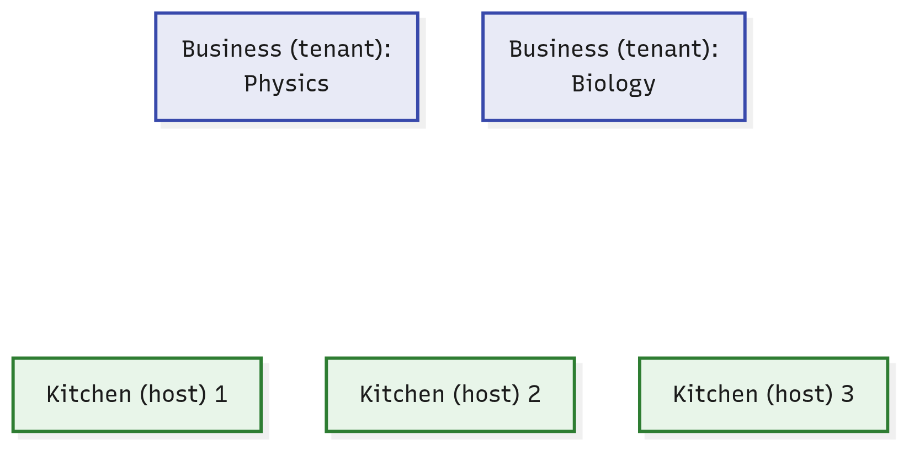
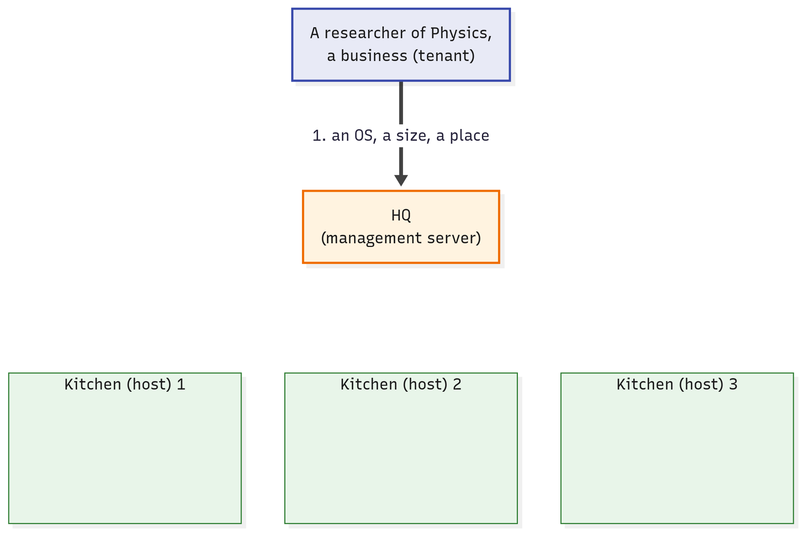
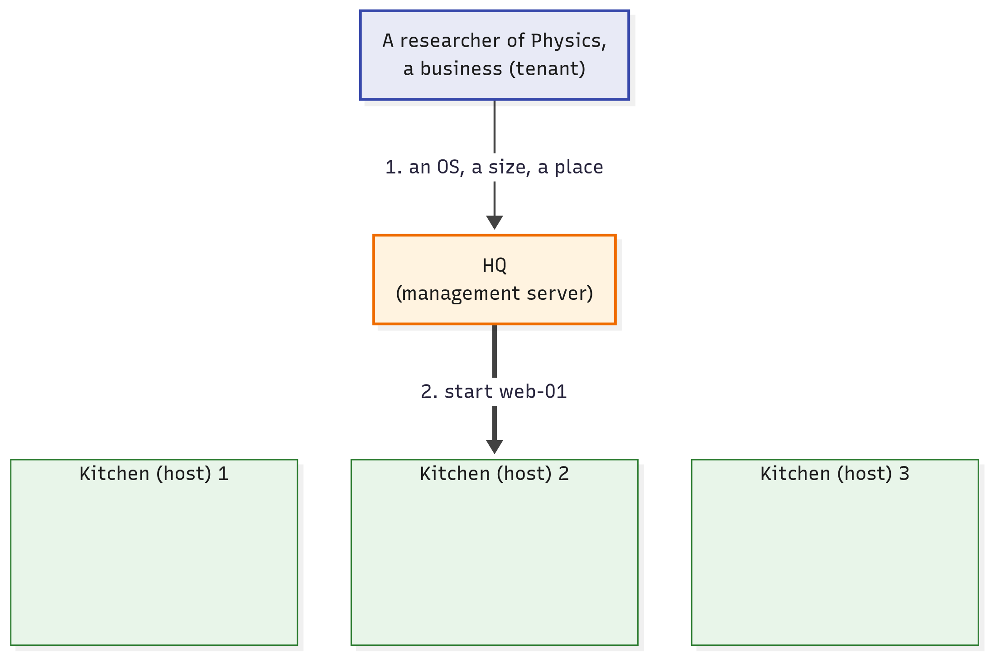
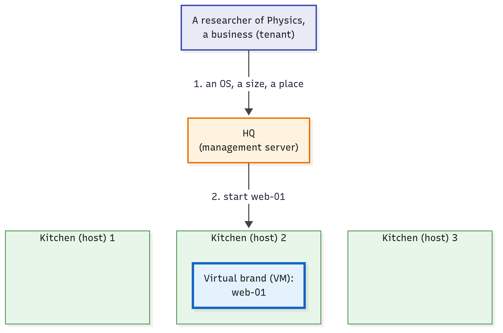

# What Does a Cloud Add to Virtual Machines?

**Level:** Beginner · **Type:** Concept · **Written against:** commit `1a48a87587` · **Reading time:** about 15 minutes

In the [last article](02.Hypervisors.md#follow-one-vm-a-start-and-a-disk-write), an admin asked libvirt to start a VM, and moments later Ubuntu was booting.

On one machine, that's all it takes.

Now picture a university. Its IT team runs five KVM hosts, and fifty researchers want VMs.

The requests arrive by email. For each one, someone has to read it, pick a host, log in to it and ask its libvirt.

Is that a cloud? Not yet. So what's missing, and why would anyone need CloudStack?

## What you'll learn

- Why running VMs isn't yet a cloud, and the two things a cloud adds: self-service and a shared pool.
- What a tenant is, and why tenants can share hosts but never each other's VMs.
- What CloudStack's management server does with a request for a VM, step by step.
- Why CloudStack isn't a hypervisor, and what keeps running when the management server stops.

## Running VMs by hand: one admin, five hosts

Follow one request. A physicist emails the IT team: she'd like a small Ubuntu VM for a web page, called `web-01`.

The admin reads the email and works out which of the five hosts has room. Then the admin logs in to that host and asks its libvirt to start the VM.

Why doesn't libvirt pick the host? Because each host's libvirt manages that host's VMs, and only those.

It starts a VM where it's asked. Nothing in it chooses *which* host.


*Click the picture to enlarge it.*

Every request squeezes through one person, who picks a host and asks its libvirt. In this article's pictures, solid arrows are requests and instructions.

That works for a handful of requests. With fifty researchers, it breaks, and four questions have no good answer:

- Who picks the host? The admin guesses which one has room, or keeps a spreadsheet.
- Who remembers whose VM is where? The admin's notes, until they go out of date.
- Who stops one group from taking everything? Nobody, or a long email thread.
- Who answers at 2 a.m.? Nobody, until morning.

## A cloud is self-service from a shared pool

What would fix all four at once? [NIST](https://nvlpubs.nist.gov/nistpubs/Legacy/SP/nistspecialpublication800-145.pdf), the US standards body you met in the first two articles, defines cloud computing as:

> a model for enabling ubiquitous, convenient, on-demand network access to a shared pool of configurable computing resources (e.g., networks, servers, storage, applications, and services) that can be rapidly provisioned and released with minimal management effort or service provider interaction.

"Provisioned" means set up and handed over, and the "service provider" is whoever runs the cloud. NIST lists five traits of a cloud, and two of them are exactly what the university is missing.

The first is self-service. People take what they need themselves, whenever they need it: in NIST's words, "without requiring human interaction with each service provider". Without it, a person sits between every request and every VM, and the 2 a.m. queue is back.

The second is a shared pool. Everyone's VMs come out of the same collection of hosts, placed wherever there's room. Without it, each group gets servers of its own, which sit underused: the waste the [first article](01.Virtual-Machines.md#one-server-three-computers) started from.

A shared pool has a price: people no longer choose the machine.

NIST calls this "location independence": what you get isn't tied to one machine. The customer generally has no control over the exact location, but "may be able to specify location at a higher level of abstraction (e.g., country, state, or datacenter)". So the physicist will choose a place, never a host.

So a **cloud** is a shared pool of computers that many people take resources from by themselves, on demand, over the network, and hand back when they're done.

What is it, physically? Real machines plus software. NIST's own footnote splits a cloud into two layers: the hardware (servers, storage, network), and the software that sits above it and gives the cloud its traits.

That's why virtualisation alone isn't a cloud. KVM and libvirt work inside each host, one host at a time: they run a VM where someone asks for one.

The self-service and the pool have to come from software above the hosts.

Nor is a cloud a particular place, or "someone else's computer": it's machines offered in this self-service, pooled way, whoever owns them and wherever they are. The university's cloud is its own, in its own building: CloudStack's README says many companies run it "on-premises", for themselves.

CloudStack is that software above the hosts: free, open-source software from the Apache Software Foundation. In its [docs'](https://docs.cloudstack.apache.org/en/4.22.1.1/conceptsandterminology/concepts.html#what-is-apache-cloudstack) words, it "manages and orchestrates pools of storage, network, and computer resources": it coordinates many machines so they act as one.

## Tenants share the pool

Who shares the pool? Usually not single people, but groups. NIST's pool serves "multiple consumers using a multi-tenant model".

A **tenant** is one of those customers, usually a group such as a company or a department of a large organisation, that shares a cloud with others while being kept apart from them. CloudStack's [docs](https://docs.cloudstack.apache.org/en/4.22.1.1/adminguide/accounts.html#accounts) give the same two examples: a customer of a service provider, or a department in a large organisation.

At the university, the physics department is a tenant, and so is biology. Their VMs come out of the same five hosts.

Two misconceptions to clear up. A tenant isn't the same thing as a person, even when only one person uses it: it's what owns the VMs, and its people each log in as members of it.

CloudStack has its own names for a tenant and for those logins, which [Who May Ask the Cloud for What?](05.Accounts-And-Roles.md) *(coming soon)* explains.

And a tenant needn't be a paying customer. NIST's own example of the many consumers of one organisation's cloud is its business units: departments, like Physics and Biology.

Why does any of this matter? Because the pool is shared.

Each tenant's VMs must stay theirs, and no tenant may take the whole pool. Something has to keep them apart.

Back to the shared kitchens of the [first article](01.Virtual-Machines.md#the-picture-virtual-brands-in-a-shared-kitchen). Picture one company that owns many of those kitchens.

A **business** is a restaurant business that launches brands of its own in the company's kitchens, without ever buying an oven.

That's a tenant. Physics is a business, and `web-01` will be one of its brands. The university's IT team are the cloud's operators, the people who build and run it, so they play the company: they own the kitchens.



*Click the picture to enlarge it.*

Two businesses, three of the five kitchens, and nothing in between. Who decides which kitchen cooks each new brand?

## One program decides: the management server

Self-service and a shared pool take the admin out of every request. But the admin's jobs don't go away.

Someone still has to pick a host, keep the records, hold each tenant to its share, and answer at any hour. Now software must do it, with no person in the loop.

In CloudStack, that's one program. The **management server** is CloudStack's central program. It takes every request to the cloud (to create, change or remove something), decides what happens, records it, and instructs the hypervisors on the hosts.

"Every request to the cloud" is the precise part. A VM's own work never goes through it.

Someone logging in to a running VM over SSH, or loading the web page it serves, reaches the VM without the management server. It sits in the path of decisions, not in the path of the VMs' work.

What is it, physically? One Java program, run as one systemd service.

Java is a programming language, and its programs run inside the `java` command. The service's unit file names it "CloudStack Management Server", and starts it with a single command ([cloudstack-management.service, line 38](https://github.com/apache/cloudstack/blob/1a48a87587c03472feefb081cfac71b2ebd0f407/packaging/systemd/cloudstack-management.service#L38)):

```text
# cloudstack: packaging/systemd/cloudstack-management.service, line 38
ExecStart=/usr/bin/java $JAVA_DEBUG $JAVA_OPTS -cp $CLASSPATH $BOOTSTRAP_CLASS
```

That's what systemd runs when the service starts: one `java` process. Everything after `java` only tells it which program to run, where its files are, and with which options.

Where does it run? "The management server typically runs on a dedicated machine or as a virtual machine," say CloudStack's [docs](https://docs.cloudstack.apache.org/en/4.22.1.1/conceptsandterminology/concepts.html#management-server-overview).

In the smallest set-up, one machine runs the management server and is also a KVM host. Even then, the management server is a program of its own, beside the hypervisor: it never becomes the hypervisor.

It's one program, though several identical copies of it can run at once, as [How Do You Ask CloudStack for Something?](04.API-And-Database.md) *(coming soon)* shows. And it isn't the whole of CloudStack: you'll meet another of CloudStack's programs in a moment.

In the kitchen picture, the management server is **HQ**: the kitchen company's head office. It takes every request to launch, change or close a brand, picks the kitchen, keeps the records and sends the instructions.

And the diners? Their orders go straight to the kitchen that cooks the brand. HQ never sees them, just as a VM's own work never goes through the management server.

One warning about the picture: HQ isn't a building full of people. It's one program, running as a service. The people are the operators, who run it.


*Click the picture to enlarge it.*

HQ, the management server, now stands between the businesses and the kitchens.

> [!TIP]
> **OpenStack lens:** OpenStack, another open-source cloud platform, splits these jobs among a family of separately installed services, for identity, images, placement, compute and networking ([install guide](https://docs.openstack.org/install-guide/openstack-services.html)). They coordinate through a message queue, a kind of shared mailbox for programs ([its docs](https://docs.openstack.org/install-guide/environment-messaging.html)).
>
> CloudStack keeps its deciding in one program. A sister course on OpenStack [tells that side](https://openstack.techphistudio.de/01.General/01.Overview/#not-one-program-but-a-family).

## Follow one request through the cloud

Back to the physicist. This time there's no email. At any hour, she opens the cloud's web interface and asks for `web-01` herself: she picks an operating system, a size and a place.

She's allowed to. Out of the box, CloudStack lets ordinary users create VMs and delete them, with no operator involved.

Her request reaches the management server, which does the rest:

1. It checks that Physics may have another VM. Out of the box, a tenant may own at most 20; the operators can change that.
2. It picks a host with room: one with enough spare CPU and memory for the size she chose. She never names a host; only the cloud's operators may.
3. It writes the decision down. Its record of `web-01` now says: it belongs to Physics, and it's on host 2.
4. It sends host 2 an instruction to start the VM. On a KVM host, a CloudStack program there hands the instruction to libvirt, the same libvirt the admin used by hand. [How Does CloudStack Talk to a Host?](06.Talking-To-Hosts.md) *(coming soon)* introduces that program.
5. libvirt starts the VM, and `web-01` boots.

Here are the same steps as pictures, with what's new in each frame drawn bold.



*Click the picture to enlarge it.*

Step 1: the request reaches HQ, the management server, with an operating system, a size and a place. HQ checks that Physics is under its limit.



*Click the picture to enlarge it.*

Steps 2 to 4: HQ picks kitchen 2, which has room, writes it down, and sends kitchen 2 the instruction.



*Click the picture to enlarge it.*

Step 5: `web-01` starts in kitchen 2, run by that kitchen's own equipment.

Decide, record, instruct: that's the order in CloudStack's code too. It picks the host, writes it into the VM's record, and only then sends the instruction (the lines are on the answers page).

So who does the asking now? The management server, on the physicist's behalf.

It decides which host, and it sends the instruction. No person is in the loop.

When she no longer needs `web-01`, she deletes it herself, the same way.

The admin's four questions now have answers:

- Who picks the host? The management server, by room.
- Who remembers whose VM is where? The management server's records.
- Who stops one group from taking everything? A limit per tenant, checked on every new VM.
- Who answers at 2 a.m.? Nobody needs to: the physicist does it herself.

## Tenants share hosts, never each other's VMs

`web-01` now runs on host 2. Biology may well have a VM on host 2 too. Is that safe?

Sharing hosts is the default: it's what makes the pool a pool. The operators can reserve hosts for one tenant, "for additional security or performance guarantees" in the [docs'](https://docs.cloudstack.apache.org/en/4.22.1.1/adminguide/accounts.html#dedicating-resources-to-accounts-and-domains) words, but that's an option, not the rule.

So two guards stand between tenants, even on one host:

- On the host, the hypervisor keeps their VMs apart, as the [first article](01.Virtual-Machines.md#a-hypervisor-shares-out-the-real-machine) showed: strongly, though not absolutely.
- At the management server, a request that names a VM (to stop it, say) is checked against the VM's owner. A physicist who asks to stop a Biology VM is refused.

Their networks are kept apart too, but that's a story for later.


*Click the picture to enlarge it.*

One kitchen holds both businesses' brands, and HQ refuses Physics's request on Biology's. The dashed arrow is an answer coming back.

Tenants share hosts, never each other's VMs. In the picture: a business can't have HQ touch another business's brand.

## CloudStack commands hypervisors; it isn't one

The management server sends instructions, and the hypervisor on each host runs the VMs. Is KVM the only kind it can command?

No. CloudStack's [Compatibility Matrix](https://docs.cloudstack.apache.org/en/4.22.1.1/releasenotes/compat.html#supported-hypervisor-versions) puts it in one sentence:

> CloudStack supports three hypervisor families, KVM, XenServer/XCP-ng with XAPI, and VMware with vSphere.

You met the other two in the [last article](02.Hypervisors.md#other-hypervisors-the-same-jobs-placed-differently), as type 1 hypervisors: Xen, inside XenServer and XCP-ng, and VMware's ESXi.

The "with" parts name each family's own management software. XAPI is the service that controls XenServer and XCP-ng hosts, and vSphere means ESXi hosts managed through vCenter, VMware's manager. For those two families, CloudStack sends its instructions to that software.

So CloudStack isn't a hypervisor. It commands hypervisors, of three supported families. In the picture, each kitchen keeps its own equipment, and HQ never cooks.

## When the management server stops, the VMs carry on

If the management server decides everything, what happens when it stops?

CloudStack's [docs on reliability](https://docs.cloudstack.apache.org/en/4.22.1.1/adminguide/reliability.html#ha-for-management-server) answer directly:

> Normal operation of Hosts is not impacted by an outage of all Management Serves [sic]. All Guest Instances will continue to work.

An outage of "all" management servers means every copy is down at once; "Guest Instances" are the VMs.

Why? Because the management server isn't in the VMs' path. Each VM runs under its own host's hypervisor, and keeps running without the management server.

You've seen the same pattern one layer down: "Restarting libvirtd does not impact running guests" ([last article](02.Hypervisors.md#libvirt-starts-and-stops-the-vms)). Stop the management server's service with `systemctl stop`, and the VMs on the hosts carry on.

So what does stop, while no copy of it is running? Every request to the cloud. In the docs' words, "no new Instances can be created", and the web interface stops answering.

One more thing stops. If a host fails meanwhile, the automatic restarts that CloudStack can do for its VMs don't happen while the management server is down. [How Does CloudStack Talk to a Host?](06.Talking-To-Hosts.md) *(coming soon)* explains those restarts.


*Click the picture to enlarge it.*

HQ stopped: the researcher's request, greyed, gets no answer, and the VMs already running carry on.

In the picture, HQ has closed for the night. The kitchens keep cooking the brands already open, but no new brand can launch until morning.

## In short

- KVM and libvirt run VMs on one host, whenever someone asks that host. A cloud adds self-service from a shared pool: many people take VMs for themselves, from one collection of hosts, with no person in the loop.
- Tenants are the customers that share a cloud, usually groups such as companies or departments. They share hosts, never each other's VMs.
- In CloudStack, one program does the deciding: the management server. It takes every request to the cloud, picks a host with room, records whose VM is where, and instructs the chosen host. Several copies of it can run at once.
- CloudStack isn't a hypervisor: it commands hypervisors of three supported families (KVM, XenServer/XCP-ng and VMware). When the management server stops (every copy of it, if there are several), the running VMs carry on; what stops is every request to the cloud, and the automatic restarts after a host fails.
- In the course's picture, tenants are businesses that launch brands in a company's kitchens, and the management server is HQ, which picks the kitchen for each brand a business launches.

## Check yourself

1. The university's IT team runs KVM on five hosts, and creates VMs when researchers email them. Is that a cloud? What's missing?
2. Self-service and a shared pool take the admin out of every request. What must the software do instead?
3. At 3 a.m., the machine running the cloud's only management server crashes. What happens to the VMs already running, and what can't anyone do until it's back?
4. Physics and Biology are tenants of the same cloud, and two of their VMs run on the same host. What is a tenant? Can a physicist stop the Biology VM, and what keeps the two apart?
5. Is CloudStack a hypervisor? What does it do with KVM, XenServer and VMware hosts?

[Check your answers →](99.Check-Yourself-Answers/03.What-A-Cloud-Adds.md)

## Further reading

- [NIST SP 800-145, The NIST Definition of Cloud Computing](https://nvlpubs.nist.gov/nistpubs/Legacy/SP/nistspecialpublication800-145.pdf): the whole definition, all five traits, in two pages.
- [When the management server is down](https://docs.cloudstack.apache.org/en/4.22.1.1/adminguide/reliability.html#ha-for-management-server), in CloudStack's docs on reliability: what keeps running, and what stops.
- [Supported Hypervisor Versions](https://docs.cloudstack.apache.org/en/4.22.1.1/releasenotes/compat.html#supported-hypervisor-versions), in CloudStack's Compatibility Matrix: the three families, and the versions of each.
- [ACS for Beginners, part 2](https://www.shapeblue.com/acs-for-beginners-part-2-architecture-and-key-components/): CloudStack's parts in plain words, from ShapeBlue, a company whose engineers write much of CloudStack.

---

**Next up:** [How Do You Ask CloudStack for Something?](04.API-And-Database.md) *(coming soon)* The management server decides. How do you ask it for anything, and where does it keep what it knows?
