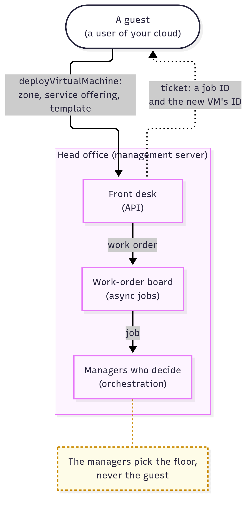

# What Is CloudStack? A Hotel for Computers

**Level:** Beginner · **Type:** Big picture · **Written against:** commit `1a48a87587` · **Reading time:** about 30 minutes

---

Your organisation's servers sit in a back room, and everyone wants a piece of them. Getting one for a test means emailing your team, and waiting.

Now picture a hotel at midnight. A guest taps a card at a kiosk, picks a room type, and a key card slides out. Nobody was woken up, and the guest never chose a floor. A head office picked the room, wrote it down, and told the floor staff.

Your boss asks: could our servers work like that?

They can. **Apache CloudStack is free software that turns your servers into a self-service cloud, run from one head office.**

In this course, you're the **operator**: the person who builds and runs that cloud. Your colleagues are its **users**, the hotel's guests.

So what is a cloud, really? And what does CloudStack add that your servers can't do alone?

**What you'll learn:**

- What makes a cloud, and why virtualization alone isn't one
- What Apache CloudStack is, and who runs it
- The hotel the whole course builds on, and where it breaks
- What your users do: one request, `deployVirtualMachine`, picking a zone but never a server
- Who's who: developers, operators like you, and users, on one real rule
- Where CloudStack came from, and how to read 4.22.1.1 or 24.0.0

---

## The cloud, without the fog

A cloud isn't a place. It's a service: computers people get for themselves when they want them, and hand back when they're done.

You can **buy** a car, or **rent** one for the days you need it. Computers are the same: own servers, or rent a slice of someone else's.

So what makes a cloud? The US standards body NIST [defines cloud computing](https://csrc.nist.gov/pubs/sp/800/145/final) by five traits. Read them as your checklist:

1. **Self-service.** Users get resources themselves, "without requiring human interaction" with the provider ([NIST](https://csrc.nist.gov/glossary/term/on_demand_self_service)). A vending machine, not a shop assistant.
2. **Reachable over the network**, from a web page or a program.
3. **A shared pool.** Many customers share one pile of hardware, each walled off from the others: that's **multi-tenant**. They pick at most a broad location, such as a data centre, never their machine ([NIST](https://csrc.nist.gov/glossary/term/resource_pooling)). CloudStack takes that literally, as [you'll see](#why-your-users-pick-a-hotel-site-never-a-floor).
4. **Elastic.** Users grow and shrink fast: ten servers this afternoon, two tonight.
5. **Measured.** The cloud tracks what each customer uses, for billing or limits.

Clouds come in three thicknesses:

- **IaaS**, Infrastructure as a Service: raw virtual computers, networks and disks ([NIST](https://csrc.nist.gov/glossary/term/infrastructure_as_a_service)). Like renting a fully equipped kitchen: the provider supplies the oven, and the customer cooks.
- **PaaS**, Platform as a Service: the provider runs the customer's code.
- **SaaS**, Software as a Service: finished software, like web email.

A cloud is **private**, for one organisation, or **public**, open to anyone ([NIST](https://csrc.nist.gov/glossary/term/private_cloud)). **CloudStack is IaaS**, used for both. Yours will be private.

## The magic trick: virtualization

How can many customers share one server, each believing it has its own? With **virtualization**: one real computer pretending to be many.

Picture a long hotel floor, divided into rooms by movable walls. Each room has its own door, lock and meter.


*Click the picture to enlarge it.*

In a computer:

- the **floor** is one physical server, which CloudStack calls a **host**,
- each **room** is a **virtual machine (VM)**: a complete computer made of software, with its own operating system (CloudStack's web pages say *Instance*),
- the walls, locks and meters are the **hypervisor**: the software that splits the machine into VMs and keeps them apart ([NIST](https://csrc.nist.gov/glossary/term/hypervisor)).

Linux does something smaller: each *process* behaves as if it had the CPU to itself. A VM believes it has a whole computer, kernel included, so Ubuntu and Windows can share one box.

On Linux, the hypervisor is in the kernel: **KVM** (Kernel-based Virtual Machine), helped by **QEMU** and **libvirt**. "The main requirement for KVM hypervisors is the libvirt and Qemu version" ([KVM guide](https://docs.cloudstack.apache.org/en/4.22.1.1/installguide/hypervisor/kvm.html)); [The Foundation Services](05.Foundation-Services.md) *(coming soon)* explains all three.

KVM needs a CPU with hardware virtualization (Intel VT-x or AMD-V). Check your servers:

```bash
# Prints vmx (Intel VT-x) or svm (AMD-V); nothing means no hardware virtualization
grep -m1 -Ewo 'vmx|svm' /proc/cpuinfo
# Lists kvm_intel or kvm_amd, plus kvm, if the KVM kernel modules are loaded
lsmod | grep kvm
```

Inside a VM, the first may print nothing unless *nested virtualization*, VMs inside a VM, is allowed; [the install posts](11.Install-By-Hand/README.md) *(coming soon)* say how to switch it on.

??? info "Under the hood: CloudStack checks the same thing"

    CloudStack's **agent**, its helper program on each KVM host ([the floor attendant](#the-floors-do-the-work)), asks libvirt at start-up whether the machine can run "HVM" guests, which need those CPU features, and refuses to start if not ([code](https://github.com/apache/cloudstack/blob/1a48a87587c03472feefb081cfac71b2ebd0f407/plugins/hypervisors/kvm/src/main/java/com/cloud/hypervisor/kvm/resource/LibvirtComputingResource.java#L1419-L1425)):

    ```java
    // cloudstack: plugins/hypervisors/kvm/src/main/java/com/cloud/hypervisor/kvm/resource/LibvirtComputingResource.java, lines 1419–1425
    if (HypervisorType.KVM == hypervisorType) {
        /* Does node support HVM guest? If not, exit */
        if (!IsHVMEnabled(conn)) {
            throw new ConfigurationException("NO HVM support on this machine, please make sure: " + "1. VT/SVM is supported by your CPU, or is enabled in BIOS. "
                    + "2. kvm modules are loaded (kvm, kvm_amd|kvm_intel)");
        }
    }
    ```

    `throw` stops the start-up with an error naming both things you just checked: the CPU feature (switched on in the BIOS) and the `kvm` modules. No hardware virtualization, no host.

**But virtualization alone isn't a cloud.** With KVM alone, someone still creates each VM by hand: your team, answering emails.

Picture a thousand servers and five thousand users. Who picks the server for the next VM? Who remembers whose VM is whose, and stops one user taking every disk?

That coordinating layer is CloudStack, which "manages and orchestrates pools of storage, network, and computer resources" ([Concepts and Terminology](https://docs.cloudstack.apache.org/en/4.22.1.1/conceptsandterminology/concepts.html)). **Orchestration** means coordinating many machines and steps so that one request ("give me a VM") happens correctly everywhere.

> [!TIP]
> **Kubernetes lens:** Kubernetes "operates at the container level rather than at the hardware level" ([overview](https://kubernetes.io/docs/concepts/overview/)): a container shares the host's kernel, a VM brings its own. CloudStack's own **Kubernetes Service** (CKS), which builds Kubernetes clusters *out of* CloudStack VMs ([CKS](https://docs.cloudstack.apache.org/en/4.22.1.1/plugins/cloudstack-kubernetes-service.html)), has nothing to do with these lens boxes.

## So what is CloudStack?

CloudStack is that coordinating layer. A one-sentence definition to keep in your pocket:

> **Apache CloudStack is free, open-source software that turns a room full of virtualization servers into a self-service IaaS cloud, run from one management server.**

The **management server** is CloudStack's central program, the head office: it takes every request and decides what happens.

Four things matter:

- **It's free and open source** (Apache License 2.0): anyone can read, change and reuse the code. It's a *top-level project* of the Apache Software Foundation (ASF), fully accepted by the foundation and run by its community, not a company ([About](https://cloudstack.apache.org/about/)).
- **It runs on hardware you choose.**
- **It drives hypervisors; it isn't one.** It's a common misconception that CloudStack runs the VMs. The hypervisors do: "CloudStack supports three hypervisor families, KVM, XenServer/XCP-ng with XAPI, and VMware with vSphere"; others carry notes like "not tested to work fine for last many CloudStack releases" ([Compatibility Matrix](https://docs.cloudstack.apache.org/en/4.22.1.1/releasenotes/compat.html)). Your lab will use KVM; [The Core Subsystems](07.Core-Subsystems.md) *(coming soon)* compares them.
- **It's one product**, "a management server and agents (if needed)" ([About](https://cloudstack.apache.org/about/)): one git repository, about 8,300 Java files at this post's commit.

Its README calls it a "turnkey solution": ready to use as delivered, with the whole stack in one product ([answer 1](08.Check-Yourself-Answers/01.Overview.md) quotes it). That stack includes an **API** (application programming interface): web addresses that programs send requests to, instead of a person clicking. Everything goes through it, even CloudStack's own web pages, and it has nearly 1,000 commands.

Which raises a big question. OpenStack, for one, splits the job into separate services, each with its own API and database. Why build a whole cloud as one program? [Inside the Management Server](03.Inside-The-Management-Server.md) *(coming soon)* answers it.

> [!TIP]
> **OpenStack lens:** OpenStack's minimal cloud is five services, Keystone, Glance, Placement, Nova and Neutron ([install guide](https://docs.openstack.org/install-guide/openstack-services.html)), and it "uses a message queue to coordinate operations and status information among services" ([message queue](https://docs.openstack.org/install-guide/environment-messaging.html)). CloudStack needs no separate message-queue server: KVM agents keep their own connection to its one management server, and its event bus is optional ([Events](https://docs.cloudstack.apache.org/en/4.22.1.1/adminguide/events.html)). See the sister course's [Not one program, but a family](https://openstack.techphistudio.de/01.General/01.Overview/#not-one-program-but-a-family).

### Who uses it, and why not just rent?

The project's [list of known users](https://cloudstack.apache.org/users/) includes:

- telecoms companies: BT, Orange, NTT,
- companies: Apple, SAP,
- public cloud providers: Exoscale, Ikoula,
- universities: Imperial College, KTH.

The project compiles it itself, and some entries are old: read it as "who has used CloudStack", not "who runs it today".

Why run your own instead of renting? The project's pitch to [cloud builders](https://cloudstack.apache.org/cloud-builders) gives three reasons:

- **Lower cost**: "CloudStack leverages existing infrastructure".
- **No lock-in**: "use the hardware and software of your choice".
- **A small team can run it**: "easy to use and implement with a small team".

Those are the project's claims, not measurements. And the price: someone has to understand how it all fits together. That's you, and that's what this course is for.

## A hotel for computers

Here's the picture to carry through the course: **a CloudStack cloud is a self-service hotel chain, and you run it.** Your users are its guests.

Zoom out from [the hotel floor](#the-magic-trick-virtualization): floors make wings, wings make buildings, buildings make a hotel site, and the chain has sites in several cities. And unlike a chain with a department for every job, **this one is run from one head office.**

Who's who (building and storage words from [Concepts and Terminology](https://docs.cloudstack.apache.org/en/4.22.1.1/conceptsandterminology/concepts.html)):

| In the hotel… | In CloudStack… | What it does |
|---|---|---|
| The head office | The **management server** | Takes requests, decides, instructs |
| The front desk | The **API** | Where every request arrives |
| The lobby kiosk | The **web UI** | Turns clicks into requests |
| The phone line | **CloudMonkey** (`cmk`) | Sends requests from the command line |
| The guest registry | **Domains**, **accounts**, **users**, **projects** | Who's who, who owns what, who pays |
| Key cards | **Login sessions**, **API keys** | Prove who's asking |
| A city; a hotel site | A **region**; a **zone** | A group of nearby zones; usually one data centre, which guests pick |
| Buildings, wings, floors | **Pods**, **clusters**, **hosts** | A rack; identical servers sharing storage; one server. Hidden from guests |
| A floor's machinery | The **hypervisor** | Splits a host into VMs |
| A room | A **virtual machine** (VM) | Runs a guest's work |
| The floor attendant | The **agent**, on KVM hosts | Carries out instructions on the host |
| The catalogue of room styles | **Templates**, **ISOs** | Disk images VMs start from; installer discs |
| Room types on the menu | **Service**, **disk offerings** | Sizes (CPUs, CPU speed, memory; disk), not prices |
| Guest corridors | **Guest networks** | The networks guests' VMs join |
| A cupboard on one floor; storage rooms per wing, or for the whole site | **Primary storage** | Running VMs' disks: per host, per cluster (usual) or zone-wide |
| The warehouse | **Secondary storage** | Templates, ISOs, snapshots (saved disk copies), per zone |
| Staff rooms | **System VMs** | VMs CloudStack runs for itself |

Here's how the parts fit together:

![The CloudStack hotel. A guest, a user of your cloud, reaches the front desk (the API) through the lobby kiosk (web UI) or the phone line (CloudMonkey), and holds a key card the front desk issued. The front desk, the guest registry, the work-order board (async jobs) and the managers who decide (orchestration) all sit inside one head office (the management server): the front desk checks key cards against the guest registry, and a long request becomes a work order on the board, which the managers pick up. The managers and the floor attendant (the agent) on a floor (a KVM host) are joined by a two-way line: the attendant phones in on port 8250, and instructions come back. The attendant builds guest rooms (your users' VMs) and staff rooms (system VMs). Guest rooms keep their disks in the storage room (primary storage); staff rooms handle room styles and snapshots in the warehouse (secondary storage); both are inside the hotel site (zone). Behind the staff-only door, the managers keep their records in the ledger (MySQL or MariaDB) and take their time from the synchronized clocks (NTP); the optional billing office (usage server) keeps its records in the ledger too.](diagrams/01-hotel.png)

*Click the picture to enlarge it.*

Solid arrows are requests and instructions. The short-dotted line is a guest's key card, issued by the front desk (a login session, or an API key pair) and shown with every request. Long-dashed lines mean "relies on": where records, time, disks and room styles are kept.

Notice what's missing: no line from a guest to any floor. Guests only ever talk to the front desk. Let's walk through the picture, from the head office outwards.

### One head office decides everything

The head office is one program. It takes every request, decides what happens, writes it down, and sends out instructions.

It's a common misconception that one head office means one machine. Identical copies can share one ledger: "The Management Server itself may be deployed in a multi-node installation where the servers are load balanced" ([Concepts](https://docs.cloudstack.apache.org/en/4.22.1.1/conceptsandterminology/concepts.html)). Your lab will run one.

A file you already know how to read starts it, a systemd unit ([code](https://github.com/apache/cloudstack/blob/1a48a87587c03472feefb081cfac71b2ebd0f407/packaging/systemd/cloudstack-management.service#L25-L38)):

```text
# cloudstack: packaging/systemd/cloudstack-management.service, lines 25–38
[Unit]
Description=CloudStack Management Server
After=syslog.target network.target mariadb.service mysqld.service mysql.service
Wants=mariadb.service mysqld.service mysql.service

[Service]
UMask=0022
Type=simple
User=cloud
EnvironmentFile=/etc/default/cloudstack-management
WorkingDirectory=/var/log/cloudstack/management
PIDFile=/var/run/cloudstack-management.pid
ExecStartPre=/usr/share/cloudstack-common/scripts/installer/pre-check.sh
ExecStart=/usr/bin/java $JAVA_DEBUG $JAVA_OPTS -cp $CLASSPATH $BOOTSTRAP_CLASS
```

- `ExecStart=/usr/bin/java …` starts **one** Java program: the whole head office.
- `User=cloud` runs it as an ordinary user, not as root.
- `Wants=mariadb.service mysqld.service mysql.service` asks systemd to start MariaDB or MySQL too, if one is on this machine: the head office's **ledger**, [behind the "staff only" door](#behind-the-staff-only-door).

Inside that one program sit the front desk, the guest registry, the work-order board, and the managers who decide which floor each room goes on. They're sections of one building, not separate services; [Inside the Management Server](03.Inside-The-Management-Server.md) *(coming soon)* opens their doors.

### Guests only ever talk to the front desk

Your users never reach a floor. Every request, from any client, arrives at one door, the front desk:

- the **lobby kiosk**, the web UI, turns their clicks into requests,
- the **phone line**, [CloudMonkey](https://github.com/apache/cloudstack-cloudmonkey/wiki), sends them from the command line,
- their own scripts can call the desk directly.

One door means one set of checks, whoever knocks.

The desk is a web address on the management server. Its settings file, `server.properties`, is made from this template ([code](https://github.com/apache/cloudstack/blob/1a48a87587c03472feefb081cfac71b2ebd0f407/client/conf/server.properties.in#L25-L30)):

```text
# cloudstack: client/conf/server.properties.in, lines 25–30
# The HTTP port to be used by the management server
http.enable=true
http.port=8080

# Max inactivity time in minutes for the session
session.timeout=30
```

A **port** is the number that picks which program on a machine a connection reaches, like 22 for SSH; the desk answers on 8080. The kiosk has no back door: its configuration points at the desk's address ([code](https://github.com/apache/cloudstack/blob/1a48a87587c03472feefb081cfac71b2ebd0f407/ui/public/config.json#L1-L2)):

```text
# cloudstack: ui/public/config.json, lines 1–2
{
  "apiBase": "/client/api",
```

Key cards come in two kinds:

- the web UI's **login session**, which lapses after 30 idle minutes (`session.timeout=30`),
- an **API key** and a **secret key**, which a program uses to sign every request ([Programmer Guide](https://docs.cloudstack.apache.org/en/4.22.1.1/developersguide/dev.html)); [The Control-Plane Building Blocks](06.Control-Plane-Building-Blocks.md) *(coming soon)* shows how.

The **guest registry** says what a key card means ([Roles, Accounts, Users, and Domains](https://docs.cloudstack.apache.org/en/4.22.1.1/adminguide/accounts.html)):

- An **account** is one customer or department. It owns things and gets the bill: "Resources belong to the Account, not individual Users in that Account."
- **Users** are the people who log in to an account.
- **Domains** group accounts into a tree, say one per reseller.
- **Projects** let several accounts share resources.

### The floors do the work

VMs run on the hosts, under the hypervisor. The head office decides and instructs; it never runs a guest's VM.

On a KVM host, CloudStack's **agent** is the floor attendant. Unusually for a hotel, the attendant phones in, on its **staff line**: its settings file names the head office's port ([code](https://github.com/apache/cloudstack/blob/1a48a87587c03472feefb081cfac71b2ebd0f407/agent/conf/agent.properties#L45-L46)):

```properties
# cloudstack: agent/conf/agent.properties, lines 45–46
# The port that the management server is listening on.
port=8250
```

The agent dials the management server on port 8250, not the other way round, and instructions come back on that line; [Architecture, part 2](02.Architecture/02.Who-Calls-Whom.md#the-attendant-phones-in) follows it.

**Here the metaphor breaks: only KVM floors have an attendant.** The agent's package says so ([code](https://github.com/apache/cloudstack/blob/1a48a87587c03472feefb081cfac71b2ebd0f407/debian/control#L30-L33)):

```text
# cloudstack: debian/control, lines 30–33
Description: CloudStack agent
 The CloudStack agent is in charge of managing shared computing resources in
 a CloudStack powered cloud.  Install this package if this computer
 will participate in your cloud as a KVM HyperVisor.
```

On VMware and XenServer, the head office talks to the floor's own management service instead (vCenter, XAPI). CloudStack's 2012 [architecture notes](https://cwiki.apache.org/confluence/spaces/CLOUDSTACK/pages/30148035/Alex+s+Architecture+Notes) call this a "Direct Agent", one that "runs within the management server", unlike KVM's "Connected Agent". A likely reason, though no design document states it: those hypervisors come with their own remote control.

The floors also hold **staff rooms**: **system VMs**, which CloudStack "creates, starts, and stops" for itself ([System VMs](https://docs.cloudstack.apache.org/en/4.22.1.1/adminguide/systemvm.html)). The main three:

- the **virtual router**, switchboard and doorman of a guest's corridors: guests can ping it and set up port forwarding on it (passing outside connections through to a VM), but can't log in to it,
- the **secondary storage VM**, the porter, for jobs like "downloading a new Template to a Zone, copying Templates between Zones, and Snapshot backups" ([same page](https://docs.cloudstack.apache.org/en/4.22.1.1/adminguide/systemvm.html#secondary-storage-vm)),
- the **console proxy VM**, a remote-control window into a guest's room: it shows a VM's screen in the browser.

### Behind the "staff only" door

Every hotel has rooms the guests never see. Yours has three:

- the **ledger**, a **database** where the head office writes everything down: MySQL or MariaDB, two closely related database programs. CloudStack 4.22 needs "MySQL 8.4 (or equivalent compatible DBMS)" ([Compatibility Matrix](https://docs.cloudstack.apache.org/en/4.22.1.1/releasenotes/compat.html)).
- **synchronized clocks**: **NTP** (Network Time Protocol) keeps every server's clock in step, because "Unsynchronized clocks can cause unexpected problems" ([KVM guide](https://docs.cloudstack.apache.org/en/4.22.1.1/installguide/hypervisor/kvm.html)).
- the **billing office**, the **usage server**: a separate, optional CloudStack program that turns events into usage records for billing ([Optional installation](https://docs.cloudstack.apache.org/en/4.22.1.1/installguide/optional_installation.html)); without it, there are none.

The ledger and the clocks aren't part of CloudStack. [The Foundation Services](05.Foundation-Services.md) *(coming soon)* covers each: why it's needed, and what could replace it, with MySQL and MariaDB side by side.

> [!NOTE]
> Where this metaphor breaks:
>
> - A room is *built* when a guest asks, and demolished when they leave.
> - A room can move to another floor of its wing with the guest inside: **live migration**, moving a running VM to another host in its cluster "without interrupting service to the user" ([Concepts](https://docs.cloudstack.apache.org/en/4.22.1.1/conceptsandterminology/concepts.html)).
> - Guests never learn their floor or building: pods and hosts "are not visible to the end user" (same page).
> - Each city has its own head office: a region "is controlled by its own cluster of Management Servers" (same page; "cluster" here just means a group, not a wing).
>
> Use the hotel to remember *who does what*; the code tells you *exactly how*.

> [!TIP]
> **Kubernetes lens:** The head office and its ledger play the control plane and etcd, a "consistent and highly-available key value store" ([components](https://kubernetes.io/docs/concepts/overview/components/)), but as one Java program. The attendant is like a node's `kubelet`, a host like a node, `cmk` like `kubectl`. CloudStack takes orders, Kubernetes a desired state. Two word clashes:
>
> - a CloudStack **pod** is a rack of servers, not a group of containers,
> - a CloudStack **cluster** is one wing of identical hosts, not the whole system.

## Checking in: one request, one new VM

Your cloud is running. Who's its first guest? Usually you, trying it out. So let's check in the way your users will: for this section and the next two, you're on the guest's side of the desk.

Checking in is **one request**, `deployVirtualMachine`. The rest is choosing what goes in it:

1. **Get a key card.** Log in to the kiosk at `http://<server>:8080/client`: on a fresh install, `admin` with password `password`, which the first login offers to change ([Quick Installation Guide](https://docs.cloudstack.apache.org/en/4.22.1.1/quickinstallationguide/qig.html)). Or give CloudMonkey the desk's address and run `sync`, which downloads the API commands you may use ([Getting Started](https://github.com/apache/cloudstack-cloudmonkey/wiki/Getting-Started)).
2. **Pick a hotel site:** a zone.
3. **Pick a room type:** a service offering, such as *Small Instance* ([answer 1](08.Check-Yourself-Answers/01.Overview.md) decodes it).
4. **Pick a room style:** a template, such as an Ubuntu image.
5. **Pick a corridor:** a guest network.
6. **Fit your own lock:** register your SSH *public* key as a *key pair*: the lock, not the key, which never leaves your laptop. (It opens your VM; it's not the API key.)
7. **Ask for the room:** submit the form, or send the command.


*Click the picture to enlarge it.*

One request carries the three main picks.

On the phone line, it's a handful of commands:

```bash
cmk list zones                                # note your zone's id
cmk list serviceofferings                     # ... a room type's id
cmk list templates templatefilter=featured    # ... a room style's id (featured: public ones the operator picked out)
cmk list networks                             # ... a network's id
cmk register sshkeypair name=my-laptop publickey="$(cat ~/.ssh/id_ed25519.pub)"
cmk deploy virtualmachine zoneid=<zone-id> serviceofferingid=<offering-id> \
    templateid=<template-id> networkids=<network-id> keypair=my-laptop name=web1
```

`deploy virtualmachine` is CloudMonkey's verb-and-noun spelling of `deployVirtualMachine` ([cache.go](https://github.com/apache/cloudstack-cloudmonkey/blob/6.6.0/config/cache.go#L132-L141)). The IDs are **UUIDs**, long unique IDs like `a1b2c3d4-…`: the API names everything by ID. CloudMonkey waits for the work to finish, then prints the result as JSON (structured text) by default ([usage](https://github.com/apache/cloudstack-cloudmonkey/wiki/Usage)).

In the web UI, the new VM appears under **Instances** ([code](https://github.com/apache/cloudstack/blob/1a48a87587c03472feefb081cfac71b2ebd0f407/ui/public/locales/en.json#L2912)):

```text
# cloudstack: ui/public/locales/en.json, line 2912
"label.vms": "Instances",
```

So one thing has three names: a VM, an *Instance* (UI and docs) and `virtualmachine` (API).

??? info "Under the hood: the command in the code"

    The command is declared like this ([code](https://github.com/apache/cloudstack/blob/1a48a87587c03472feefb081cfac71b2ebd0f407/api/src/main/java/org/apache/cloudstack/api/command/user/vm/DeployVMCmd.java#L47-L49)):

    ```java
    // cloudstack: api/src/main/java/org/apache/cloudstack/api/command/user/vm/DeployVMCmd.java, lines 47–49
    @APICommand(name = "deployVirtualMachine", description = "Creates and automatically starts an Instance based on a service offering, disk offering, and Template.", responseObject = UserVmResponse.class, responseView = ResponseView.Restricted, entityType = {VirtualMachine.class},
            requestHasSensitiveInfo = false)
    public class DeployVMCmd extends BaseDeployVMCmd {
    ```

    `@APICommand(…)` is a Java *annotation*, a label on the class below it, giving the command's name and description. The [API reference](https://cloudstack.apache.org/api/apidocs-4.22/apis/deployVirtualMachine.html) marks only the zone and the service offering as required; a request also says what the VM starts from, usually a template.

**The same request, three ways.** "All CloudStack API requests are submitted in the form of a HTTP GET/POST with an associated command and any parameters" ([Programmer Guide](https://docs.cloudstack.apache.org/en/4.22.1.1/developersguide/dev.html)):

- the **web UI** fills in the parameters from its form,
- **CloudMonkey** sends the `cmk deploy virtualmachine …` above,
- **a program** sends the web request itself:

    ```text
    http://<server>:8080/client/api?command=deployVirtualMachine&zoneid=<zone-id>&serviceofferingid=<offering-id>&templateid=<template-id>&apiKey=<your-api-key>&signature=<signature>
    ```

The `signature` is computed from the secret key; [The Control-Plane Building Blocks](06.Control-Plane-Building-Blocks.md) *(coming soon)* shows how.

### Why your users pick a hotel site, never a floor

You picked a zone, and CloudStack picked the host. Could you have named the host? Yes: you logged in as the root admin. Your users can't.

A **root admin** is the cloud's top administrator: you ([more below](#who-sets-the-rules-developers-operators-and-users)). The deploy command has a parameter for naming the host, and its description says who may use it ([code](https://github.com/apache/cloudstack/blob/1a48a87587c03472feefb081cfac71b2ebd0f407/api/src/main/java/org/apache/cloudstack/api/command/user/vm/BaseDeployVMCmd.java#L176-L177)):

```java
// cloudstack: api/src/main/java/org/apache/cloudstack/api/command/user/vm/BaseDeployVMCmd.java, lines 176–177
@Parameter(name = ApiConstants.HOST_ID, type = CommandType.UUID, entityType = HostResponse.class, description = "destination Host ID to deploy the VM to - parameter available for root admin only")
private Long hostId;
```

Everyone else only picks a zone (the [API reference](https://cloudstack.apache.org/api/apidocs-4.22/apis/deployVirtualMachine.html) marks it required), and CloudStack picks the host. That isn't a missing feature: it's NIST's shared pool, where the customer "has no control or knowledge over the exact location" but may choose "a higher level of abstraction (e.g., country, state, or datacenter)" ([NIST](https://csrc.nist.gov/glossary/term/resource_pooling)).

And a zone really is a data centre, down in the ledger: the zone's class, `DataCenterVO`, is stored in a table called `data_center` ([code](https://github.com/apache/cloudstack/blob/1a48a87587c03472feefb081cfac71b2ebd0f407/engine/schema/src/main/java/com/cloud/dc/DataCenterVO.java#L40)):

```java
// cloudstack: engine/schema/src/main/java/com/cloud/dc/DataCenterVO.java, line 40
@Table(name = "data_center")
```

Who picks the host, and how, is a story for [How It Unfolds](04.How-It-Unfolds.md) *(coming soon)*.

### A ticket, not a wait

Building a VM takes a while. So the desk doesn't keep the guest at the counter: it hands back a ticket, and the work goes on behind the scenes.


*Click the picture to enlarge it.*

Commands are made **asynchronous** "when they can potentially take a long period of time to complete", like this one. It answers at once with a **job ID**, plus "the resource ID", here the new VM's ([Programmer Guide](https://docs.cloudstack.apache.org/en/4.22.1.1/developersguide/dev.html)): the short-dotted line. CloudMonkey keeps checking the ticket for you, which is why it seems to pause.

That's the hotel's **work-order board**: each long request like this one becomes a work order, an **async job**, tracked until it's done. Then the managers take over:



*Click the picture to enlarge it.*

The managers pick the floor: the decision your users never make.


*Click the picture to enlarge it.*

The instruction goes down the staff line the attendant opened, the thick line, and the attendant builds the room.

??? info "Under the hood: the asynchronous command in the code"

    `DeployVMCmd` extends `BaseDeployVMCmd` (the last line of its declaration, in the box above), which extends an asynchronous "create" command ([code](https://github.com/apache/cloudstack/blob/1a48a87587c03472feefb081cfac71b2ebd0f407/api/src/main/java/org/apache/cloudstack/api/command/user/vm/BaseDeployVMCmd.java#L71)):

    ```java
    // cloudstack: api/src/main/java/org/apache/cloudstack/api/command/user/vm/BaseDeployVMCmd.java, line 71
    public abstract class BaseDeployVMCmd extends BaseAsyncCreateCustomIdCmd implements SecurityGroupAction, UserCmd {
    ```

    `extends` means "is a kind of".

That one request set off a chain of decisions and instructions down to the floor attendant; [How It Unfolds](04.How-It-Unfolds.md) *(coming soon)* follows it step by step.

## Who sets the rules: developers, operators and users

Who decides how your hotel behaves? Three groups, each with a hand on the rules:

- **Developers** write CloudStack's code, defaults included.
- **Operators**, like you, run one particular cloud: they install it, configure it and change the defaults.
- **Users**, the guests, work inside their accounts. They never see the rules; they meet them.

CloudStack uses the word *operator* too, in the billing office's package ([code](https://github.com/apache/cloudstack/blob/1a48a87587c03472feefb081cfac71b2ebd0f407/debian/control#L38-L40)):

```text
# cloudstack: debian/control, lines 38–40
Description: CloudStack usage monitor
 The CloudStack usage monitor provides usage accounting across the entire cloud for
 cloud operators to charge based on usage parameters.
```

Let's watch all three on one rule. Asha, one of your users, works in an account that already has 20 VMs. She asks for a 21st, and the front desk says no.

![Three hands on one rule. The developers wrote the default into CloudStack's code, copied into the ledger on the first start as the global setting max.account.user.vms = 20. You, the operator (root admin), can change it, in Global Settings or as one account's own limit. Asha, a user of your cloud, asks the front desk (the API) for a 21st VM; the front desk checks the limit in the ledger (long-dashed) and sends back a refusal (short-dotted). A note by the operator says root admins are never limited, so you won't hit the 20.](diagrams/01-rules.png)

*Click the picture to enlarge it.*

The developers wrote that limit into the code, as a default ([code](https://github.com/apache/cloudstack/blob/1a48a87587c03472feefb081cfac71b2ebd0f407/server/src/main/java/com/cloud/configuration/Config.java#L1170-L1178)):

```java
// cloudstack: server/src/main/java/com/cloud/configuration/Config.java, lines 1170–1178
// Account Default Limits
DefaultMaxAccountUserVms(
        "Account Defaults",
        ManagementServer.class,
        Long.class,
        "max.account.user.vms",
        "20",
        "The default maximum number of user VMs that can be deployed for an account",
        null),
```

That's a setting, `max.account.user.vms`, with the default `20`. Neither the code nor its history says why 20.

On its very first start, the management server copies its settings' defaults, this one included, into its ledger. From then on, it's a **global setting**: a named option in CloudStack's database, which you change in the web UI under **Global Settings** ([Configuration](https://docs.cloudstack.apache.org/en/4.22.1.1/installguide/configuration.html)), not in a file. A command made for the job, `updateResourceLimit`, gives one account or domain its own limit.

Asha sees none of this, only a refused request, with an error naming the limit she hit.

In CloudStack, an operator holds the **root admin** role, one of "four default roles: root admin, resource admin, domain admin and User" ([accounts page](https://docs.cloudstack.apache.org/en/4.22.1.1/adminguide/accounts.html)); a resource admin is a kind of domain admin, which later posts meet. A **domain admin** sits in between: an administrator for one domain, a reseller say, with no "visibility into physical servers or other domains". And root admins aren't limited at all: the check skips their accounts, so you won't hit the 20 while you test.

[Answer 3](08.Check-Yourself-Answers/01.Overview.md) shows the code for the first-start copy, the command, Asha's error and that exemption. One person can wear several hats: in [the lab you'll build](11.Install-By-Hand/README.md) *(coming soon)*, you're both operator and user.

> [!TIP]
> **OpenStack lens:** The sister course's example rule, OpenStack's token lifetime, is a line in Keystone's configuration file, which an operator edits ([A hotel for computers](https://openstack.techphistudio.de/01.General/01.Overview/#a-hotel-for-computers)). CloudStack keeps most rules in its database, changed through the UI or API; only a few start-up settings live in files, like `server.properties`. So management servers sharing a ledger share one rule book. Restarts aren't gone, though: some settings, this 20-VM default among them, are read only at start-up ([answer 3](08.Check-Yourself-Answers/01.Overview.md) shows why).

> [!TIP]
> **Kubernetes lens:** A CloudStack operator is roughly a Kubernetes *cluster administrator*. But a Kubernetes **Operator**, capital O, is unrelated: a program that manages an application in the cluster ([Operator pattern](https://kubernetes.io/docs/concepts/extend-kubernetes/operator/)).

## A short history

CloudStack began as a company's product, and became an Apache community project in 2012 ([History](https://cloudstack.apache.org/history/)):

- **2008:** a start-up, VMOps, begins the project; it later renames itself Cloud.com.
- **May 2010:** Cloud.com releases much of the code as open source, under the GPLv3, another open-source licence.
- **July 2011:** Citrix buys Cloud.com, and releases the rest of the code in August.
- **Early 2012:** Citrix releases CloudStack 3.0.
- **April 2012:** Citrix relicenses it under the Apache License 2.0; on 16 April it's accepted into the **Apache Incubator**, where projects joining the ASF set up their infrastructure and community processes.
- **6 November 2012:** the first Apache release, 4.0.0-incubating.
- **20 March 2013:** it graduates, becoming a top-level ASF project.

Since then, a **Project Management Committee** (PMC) steers it, and much of the work is done by **committers**, contributors trusted to merge code ([About](https://cloudstack.apache.org/about/)). In the year before this post's commit, about a hundred different author names appear in the git history.

The code still remembers the Cloud.com years, in a changelog, in names kept on purpose, and in half its file paths; [answer 5](08.Check-Yourself-Answers/01.Overview.md) shows where.

## How versions are numbered

Two things tell you what a CloudStack version is: its release number, and whether that release gets long-term support. And from the next release, the numbers get shorter.

You'll install **4.22.1.1**. Until now, versions have had four parts ([LTS page](https://cwiki.apache.org/confluence/display/CLOUDSTACK/LTS)):

- `4` has never changed since the first Apache release,
- `22` is the release, the number that really counts,
- the first `1` is the first maintenance (bug-fix) release of 22,
- the last `1` is the first security release on top of it, one with "only CVE fixes" (publicly listed security holes).

Releases come in two kinds:

- **Regular** releases "introduce new features and enhancements", and are "supported only up to the next regular or LTS release".
- **LTS** (long-term support) releases favour "stability and longevity … at the expense of new features". From 4.20 on, they're supported for two years: 18 months of all fixes, then six months of blocker and security fixes only. (The [downloads page](https://cloudstack.apache.org/downloads) still says 18 months; the LTS page has the detailed schedule.)

Since 4.21 they take turns, one of each a year, because "all releases effectively became LTS releases and made maintenance and release efforts unsustainable" ([dev@ thread](https://lists.apache.org/thread/fkl74js7vxml9c29jqmhl2ctsxsq868o)). So 4.20 and 4.22 are LTS, 4.21 and 4.23 regular, and 24.0.0, next, is planned as LTS; [answer 5](08.Check-Yourself-Answers/01.Overview.md) has the calendar.

**The jump to 24.0.0.** Here's the version in the code this course reads ([code](https://github.com/apache/cloudstack/blob/1a48a87587c03472feefb081cfac71b2ebd0f407/pom.xml#L30-L33)):

```xml
<!-- cloudstack: pom.xml, lines 30–33 -->
<groupId>org.apache.cloudstack</groupId>
<artifactId>cloudstack</artifactId>
<version>24.0.0-SNAPSHOT</version>
<packaging>pom</packaging>
```

`pom.xml` is the project's build file, and `SNAPSHOT` marks a development version, not yet released. In August 2026 the community voted to drop the "4.", which "has not carried any meaning for many years" ([vote](https://lists.apache.org/thread/4k33jyb3bnbybmqgs0j4q0oryz9kfw6j)); the change says "it is not a signal that 24 breaks APIs or introduces disruptive changes" ([PR #14041](https://github.com/apache/cloudstack/pull/14041)). From 24 on, versions have three parts, release.maintenance.security: 24.1.0 would be a maintenance release, 24.1.1 a security fix on it ([PR #14033](https://github.com/apache/cloudstack/pull/14033)).

**Which version this course uses** ([home page](../README.md#which-version-of-cloudstack)):

- **Install posts** use 4.22.1.1, the current LTS. The ASF releases source code; community members provide the ready-made packages ([Downloads](https://cloudstack.apache.org/downloads)).
- **Explanations and code links** use the development code pinned in this course's repository, about 540 commits ahead of 4.22.1.1.

Where they differ in a way that matters, the posts say so; the version number is the first example.

## Recap: one check-in

1. A guest, here you trying your own cloud, gets a key card at the kiosk or on the phone line.
2. One request, `deployVirtualMachine`, names a site, a room type and a room style, never a floor.
3. The front desk hands back a ticket at once: a job ID and the new VM's ID.
4. The work order goes on the board, and the managers pick a floor.
5. The instruction goes down the staff line the floor's attendant opened, and the attendant builds the room.

## The one-paragraph version

A cloud is self-service, network-reachable, shared, elastic and measured computing; virtualization makes it possible by turning one host into many VMs. Apache CloudStack is free, open-source IaaS software that turns your hosts into a self-service hotel, which you, the operator, run from one head office: the management server, one Java program that takes every request at its front desk (the API), decides, and writes it all in its ledger (MySQL or MariaDB). The floors (hosts) do the work; on KVM floors an attendant (the agent) phones in. Your users pick a site (zone), a room type (service offering) and a room style (template), never a floor, in one request that hands back a ticket. Developers set defaults, operators change them, users meet them. You'll install 4.22 LTS, and read code that's becoming 24.0.0.

## Check yourself

1. Your organisation has 20 Linux servers with KVM, and your team creates VMs when someone emails a request. Is that a cloud? Which traits are missing, and what would CloudStack add?
2. The machine running your management server crashes at 3 a.m. What happens to your users' VMs that are already running, and what can nobody do until it's back? Why the difference?
3. Asha's 21st `deploy virtualmachine` is refused. Who chose the limit of 20, who can change it, and how? Why do you, as root admin, never hit it?
4. A user asks you to put their new VM on "the fast server in rack 3". What does CloudStack let them choose instead, why, and who could grant the request?
5. Decode 4.22.1.1. Why does this post's code say 24.0.0-SNAPSHOT while you'll install 4.22? Does 24 mean the API breaks?

[Check your answers →](08.Check-Yourself-Answers/01.Overview.md)

## Further reading

- [Concepts and Terminology (4.22)](https://docs.cloudstack.apache.org/en/4.22.1.1/conceptsandterminology/concepts.html): the official overview
- [Quick Installation Guide (4.22)](https://docs.cloudstack.apache.org/en/4.22.1.1/quickinstallationguide/qig.html): a one-machine test cloud
- [Compatibility Matrix (4.22)](https://docs.cloudstack.apache.org/en/4.22.1.1/releasenotes/compat.html): what it runs on
- [Accounts and roles (4.22)](https://docs.cloudstack.apache.org/en/4.22.1.1/adminguide/accounts.html): the guest registry
- [Programmer Guide (4.22)](https://docs.cloudstack.apache.org/en/4.22.1.1/developersguide/dev.html): the API
- [CloudMonkey usage](https://github.com/apache/cloudstack-cloudmonkey/wiki/Usage): using `cmk`
- [History](https://cloudstack.apache.org/history/): from VMOps to Apache
- [Long Term Support](https://cwiki.apache.org/confluence/display/CLOUDSTACK/LTS): the release calendar
- [OpenStack from the Ground Up, post 01](https://openstack.techphistudio.de/01.General/01.Overview/): the same hotel, with many departments

---

**Next up:** [Architecture: One Head Office, Many Floors](02.Architecture/README.md). Which machines your cloud runs on, what runs on each, and how a hotel site divides into buildings, wings and floors. The [module's reading order](README.md#reading-order) shows the road beyond.
