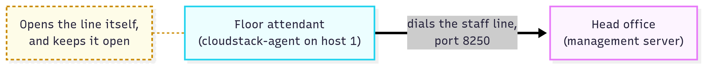
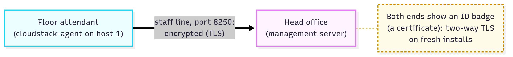
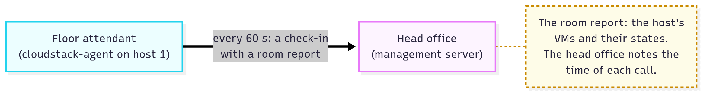
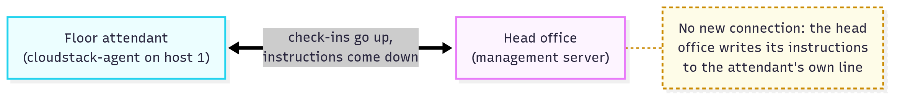
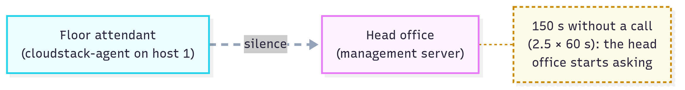
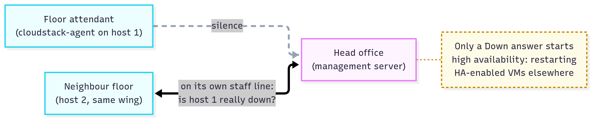
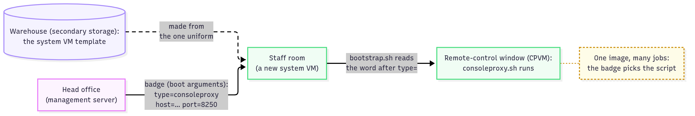

# Who Calls Whom in a CloudStack Cloud?

**Level:** Beginner → Intermediate · **Type:** Big picture · **Written against:** commit `1a48a87587` · **Reading time:** about 30 minutes

*Part 2 of 2 of [Architecture: One Head Office, Many Floors](README.md). [Part 1](01.Where-Everything-Lives.md) showed where everything lives.*

---

Picture the head office of your hotel chain on a Monday morning.

On the desk sits a row of telephones, every line in use. Each was opened by a floor attendant on their first morning, and nobody has hung up since.

Once a minute, a voice comes down each line: "Building 1, wing A, floor 2: rooms 3 and 7 occupied." When the head office wants something done, it says so on the same line: "Build a room for a new guest."

Then one line goes quiet. Nobody panics. The head office waits two and a half minutes, then asks the floor's neighbours in the same wing whether its lights are on, before it moves a single guest.

That's your CloudStack cloud, almost word for word.

[Part 1](01.Where-Everything-Lives.md) placed your lab's KVM host in the building plan and cabled it. Now you add it to the cloud. What happens on the wire? And why is it the floor that calls the head office, not the other way round?

**What you'll learn:**

- How a KVM host's agent and the management server talk: who dials, how the line is secured, and what a check-in carries
- What CloudStack does when the line goes quiet, and why it waits before moving any VM
- Why VMware and XenServer hosts have no agent, and what takes its place
- What each system VM does, how it learns its job, and which ones phone in
- Every connection in your two-machine lab, and what changes with several management servers

---

## The attendant phones in

Who calls whom?

It's a common misconception that the head office connects to each floor to give orders. On a KVM floor, it doesn't.

The floor attendant, the `cloudstack-agent` program on each KVM host ([part 1](01.Where-Everything-Lives.md#a-floors-machine)), dials the head office, the management server, on its **staff line**: port 8250. Orders come back on that same call. The head office goes to a floor only to set it up, and for repairs.

That one choice is why your KVM host needs no open port for the head office's instructions, as [the map](#who-talks-to-whom-the-whole-map) at the end shows.

Let's follow the line, step by step, from the moment you add your host. In the pictures, the thick line is the staff line, the dotted one is SSH, a grey dashed line has gone quiet, and a yellow note points at what changed. An arrowhead points away from whoever opened the line; two heads mean traffic both ways. ([How It Unfolds](../04.How-It-Unfolds.md) *(coming soon)* tells it as a story: a whole cloud waking up.)

### Hiring an attendant: the engineer's one visit

Adding a KVM host is the one time the head office goes to the floor. Think of an engineer who lets themselves in, sets up the attendant's phone, writes the head office's number in the attendant's notebook, and leaves.


*Click the picture to enlarge it.*

**Step 1: the head office visits once.** When you add a KVM host with the `addHost` command, you give it the host's username and password. The head office logs in over SSH, port 22, and runs a setup script, `cloudstack-setup-agent`.

The script writes the attendant's notebook, `/etc/cloudstack/agent/agent.properties`: the head office's address, the floor's zone, pod and cluster, and the port to call, `8250` ([post 01](../01.Overview.md#the-floors-do-the-work) showed that line).

Then the engineer leaves, and the head office waits for a call.

??? info "Under the hood: the visit and the notebook"

    The head office builds the setup script's arguments like this ([code](https://github.com/apache/cloudstack/blob/1a48a87587c03472feefb081cfac71b2ebd0f407/server/src/main/java/com/cloud/hypervisor/kvm/discoverer/LibvirtServerDiscoverer.java#L291-L293)):

    ```java
    // cloudstack: server/src/main/java/com/cloud/hypervisor/kvm/discoverer/LibvirtServerDiscoverer.java, lines 291–293
    setupAgentSecurity(sshConnection, agentIp, hostname);

    String parameters = " -m " + StringUtils.toCSVList(indirectAgentLB.getManagementServerList(null, dcId, null)) + " -z " + dcId + " -p " + podId     + " -c " + clusterId + " -g " + guid + " -a -s ";
    ```

    `setupAgentSecurity` gives the attendant its ID badge (step 3). Then `-m` lists the head offices, `-z`, `-p` and `-c` give the floor's zone, pod and cluster, and `-g` its ID.

    The script writes it all into the notebook ([code](https://github.com/apache/cloudstack/blob/1a48a87587c03472feefb081cfac71b2ebd0f407/python/lib/cloudutils/serviceConfig.py#L881-L891)):

    ```python
    # cloudstack: python/lib/cloudutils/serviceConfig.py, lines 881–891
    cfo = configFileOps("/etc/cloudstack/agent/agent.properties", self)
    cfo.addEntry("host", self.syscfg.env.mgtSvr)
    cfo.addEntry("zone", self.syscfg.env.zone)
    cfo.addEntry("pod", self.syscfg.env.pod)
    cfo.addEntry("cluster", self.syscfg.env.cluster)
    cfo.addEntry("hypervisor.type", self.syscfg.env.hypervisor)
    cfo.addEntry("port", "8250")
    cfo.addEntry("private.network.device", self.syscfg.env.nics[0])
    cfo.addEntry("public.network.device", self.syscfg.env.nics[1])
    cfo.addEntry("guest.network.device", self.syscfg.env.nics[2])
    cfo.addEntry("guid", str(self.syscfg.env.uuid))
    ```

    Each `addEntry` writes one `key=value` line. `host` is the head office's address: here "host" means a head office, not a floor. `zone`, `pod` and `cluster` put the building plan in the floor's own file.

### Dialling in, with ID on both ends

Now the attendant calls. It opens the line itself, and keeps it open. The head office never dials: it only answers, on one port, 8250, for every floor it has. And on a fresh install, both ends show ID before they talk.



*Click the picture to enlarge it.*

**Step 2: the attendant dials in.** At start-up, the agent takes the next head office from its list and opens the connection ([code](https://github.com/apache/cloudstack/blob/1a48a87587c03472feefb081cfac71b2ebd0f407/agent/src/main/java/com/cloud/agent/Agent.java#L243-L245)):

```java
// cloudstack: agent/src/main/java/com/cloud/agent/Agent.java, lines 243–245
final String host = this.shell.getNextHost();
connection = new NioClient(getAgentName(), host, this.shell.getPort(), this.shell.getWorkers(),
        this.shell.getSslHandshakeTimeout(), this);
```

`NioClient` is the calling side. The head office only answers, on a setting named `port` ([code](https://github.com/apache/cloudstack/blob/1a48a87587c03472feefb081cfac71b2ebd0f407/engine/orchestration/src/main/java/com/cloud/agent/manager/AgentManagerImpl.java#L234)):

```java
// cloudstack: engine/orchestration/src/main/java/com/cloud/agent/manager/AgentManagerImpl.java, line 234
protected final ConfigKey<Integer> Port = new ConfigKey<>("Advanced", Integer.class, "port", "8250", "Port to listen on for remote (indirect) agent connections.", false);
```

`"port"` is the setting's name, `"8250"` its default, and the description says what the head office does with it: "Port to listen on".

Those are the two ends of [post 01's](../01.Overview.md#the-floors-do-the-work) `port=8250`. "Indirect" is the code's word for what CloudStack's 2012 architecture notes call a Connected agent.

Why dial out? CloudStack's documents don't say why. Here's what the design makes easy:

- one listening port on the head office, however many floors there are,
- a list of head offices for the attendant to try in turn ([Growing](#growing-more-head-offices)),
- staff rooms, the VMs CloudStack runs for itself, that find the head office from settings they're given at boot ([below](#two-staff-rooms-with-their-own-phone)),
- no open port on the floors for instructions ([the map](#who-talks-to-whom-the-whole-map)).



*Click the picture to enlarge it.*

**Step 3: both ends show ID.** The line is encrypted with **TLS**, and each side can prove who it is with a **certificate**, a digital ID card. Since 4.11, a **certificate authority** (an office that issues ID cards) built into the management server issues them to the agents on KVM hosts and in two staff rooms ([below](#two-staff-rooms-with-their-own-phone)) ([PR #2239](https://github.com/apache/cloudstack/pull/2239)).

On fresh installs, `ca.plugin.root.auth.strictness` "will be `true` to enforce two-way SSL authentication …, however, it will be `false` on upgraded environments" ([Hosts](https://docs.cloudstack.apache.org/en/4.22.1.1/adminguide/hosts.html)); SSL is TLS's older name. Why the change? Before 4.11, the line "allows for any client/agent to connect and be served by the management server" ([Secure Agent Communications](https://cwiki.apache.org/confluence/display/CLOUDSTACK/Secure+Agent+Communications)).

### An introduction, then a report every minute

Once connected, the attendant introduces itself: who it is, and where it sits in the building plan. The head office answers with the floor's ID and a schedule: call every minute. Every call after that is a **heartbeat**, or ping: a short "I'm still here", sent at a fixed interval, with a room report attached.

The introduction tells the head office how big the floor is, too: "CloudStack automatically detects the amount of CPU and memory resources provided by the hosts" ([About Hosts](https://docs.cloudstack.apache.org/en/4.22.1.1/conceptsandterminology/concepts.html#about-hosts)).

The schedule, and the head office's patience, are two settings you can change ([code](https://github.com/apache/cloudstack/blob/1a48a87587c03472feefb081cfac71b2ebd0f407/engine/schema/src/main/java/com/cloud/configuration/ManagementServiceConfiguration.java#L23-L26)):

```java
// cloudstack: engine/schema/src/main/java/com/cloud/configuration/ManagementServiceConfiguration.java, lines 23–26
ConfigKey<Integer> PingInterval = new ConfigKey<Integer>("Advanced", Integer.class, "ping.interval", "60",
        "Interval in seconds to send application level pings to make sure the connection is still working", false);
ConfigKey<Float> PingTimeout = new ConfigKey<Float>("Advanced", Float.class, "ping.timeout", "2.5",
        "Multiplier to ping.interval before announcing an agent has timed out", true);
```

`ping.interval` is 60 seconds. `ping.timeout` is a multiplier: 2.5 × 60 = 150 seconds of patience. No source says why these numbers.



*Click the picture to enlarge it.*

**Step 4: a check-in every minute.** On a KVM floor, each check-in lists the host's VMs and their states, so the hook's "rooms 3 and 7 occupied" is close to literal. The head office notes the time of each call.

??? info "Under the hood: the introduction, the schedule and the room report"

    The attendant's first words ([code](https://github.com/apache/cloudstack/blob/1a48a87587c03472feefb081cfac71b2ebd0f407/agent/src/main/java/com/cloud/agent/Agent.java#L607-L612)):

    ```java
    // cloudstack: agent/src/main/java/com/cloud/agent/Agent.java, lines 607–612
    startup.setDataCenter(getZone());
    startup.setPod(getPod());
    startup.setGuid(getResourceGuid());
    startup.setResourceName(getResourceName());
    startup.setVersion(getVersion());
    startup.setArch(getAgentArch());
    ```

    Zone, pod, ID, name, version and CPU architecture. The head office's answer sets the schedule ([code](https://github.com/apache/cloudstack/blob/1a48a87587c03472feefb081cfac71b2ebd0f407/agent/src/main/java/com/cloud/agent/Agent.java#L716)):

    ```java
    // cloudstack: agent/src/main/java/com/cloud/agent/Agent.java, line 716
    pingInterval = startup.getPingInterval() * 1000L; // change to ms.
    ```

    Here `startup` is that answer, not the introduction; `* 1000L` turns seconds into milliseconds.

    On a KVM floor, each check-in carries the room report ([code](https://github.com/apache/cloudstack/blob/1a48a87587c03472feefb081cfac71b2ebd0f407/core/src/main/java/com/cloud/agent/api/PingRoutingCommand.java#L26-L28)):

    ```java
    // cloudstack: core/src/main/java/com/cloud/agent/api/PingRoutingCommand.java, lines 26–28
    public class PingRoutingCommand extends PingCommand {

        Map<String, HostVmStateReportEntry> _hostVmStateReport;
    ```

    `_hostVmStateReport` lists the host's VMs and their states.

### Instructions come back on the same call

If the head office never dials the floor, how does it give orders?

It answers on the attendant's own line. No new connection is opened: the head office writes its instructions down the line the attendant keeps open.



*Click the picture to enlarge it.*

**Step 5: instructions come back on the same line.** So a KVM host needs no open port for instructions. How commands and answers are packed and matched is for [The Control-Plane Building Blocks](../06.Control-Plane-Building-Blocks.md) *(coming soon)*.

**The engineer does come back, for repairs.** A setting, on by default, lets the head office restart an agent over SSH ([code](https://github.com/apache/cloudstack/blob/1a48a87587c03472feefb081cfac71b2ebd0f407/engine/components-api/src/main/java/com/cloud/resource/ResourceManager.java#L58-L61)):

```java
// cloudstack: engine/components-api/src/main/java/com/cloud/resource/ResourceManager.java, lines 58–61
ConfigKey<Boolean> KvmSshToAgentEnabled = new ConfigKey<>("Advanced", Boolean.class,
        "kvm.ssh.to.agent","true",
        "True if the management server will restart the agent service via SSH into the KVM hosts after or during maintenance operations",
        true);
```

Certificates go over SSH too, so port 22 stays open: "The Management Servers communicate with KVM hosts on port 22 (ssh)" ([Network Setup](https://docs.cloudstack.apache.org/en/4.22.1.1/conceptsandterminology/network_setup.html#runtime-internal-communications-requirements)).

??? info "Under the hood: writing to the attendant's line"

    The head office keeps one object per connected attendant, built around the attendant's own connection, and writes to it ([code](https://github.com/apache/cloudstack/blob/1a48a87587c03472feefb081cfac71b2ebd0f407/engine/orchestration/src/main/java/com/cloud/agent/manager/ConnectedAgentAttache.java#L41-L46)):

    ```java
    // cloudstack: engine/orchestration/src/main/java/com/cloud/agent/manager/ConnectedAgentAttache.java, lines 41–46
    public synchronized void send(final Request req) throws AgentUnavailableException {
        try {
            _link.send(req.toBytes());
        } catch (ClosedChannelException e) {
            throw new AgentUnavailableException("Channel is closed", _id);
        }
    ```

    `_link` is the attendant's line; if it's down, sending fails: "Channel is closed".

### When a floor goes quiet

What if the check-ins stop? Silence isn't proof of death. The head office asks around, the floor itself first, then its neighbours, and only a Down answer moves anyone.



*Click the picture to enlarge it.*

**Step 6: the line goes quiet.** After 150 seconds without a check-in, is the floor dead? Not necessarily. "If the application ping times out, AgentManager launches into an investigation process that tries to check if the physical resource is still alive" ([2012 architecture notes](https://cwiki.apache.org/confluence/spaces/CLOUDSTACK/pages/30148035/Alex+s+Architecture+Notes)).

A hang-up isn't the same as silence. If the attendant's program crashes outright, the floor's own system closes the line, and the head office starts asking at once. The 150-second wait is for a line that just goes quiet: a hung attendant, a frozen host, a cut cable ([answer 2](../08.Check-Yourself-Answers/02.Architecture/02.Who-Calls-Whom.md) shows the code).



*Click the picture to enlarge it.*

**Step 7: the neighbours are asked.** For KVM, once the floor itself doesn't answer, the head office asks the Up hosts of the same wing, the same cluster: the wing is a neighbourhood watch. Only a Down answer starts **high availability** (HA): restarting on another host the VMs whose offering, the room type a VM was created from ([post 01](../01.Overview.md#a-hotel-for-computers)), asks for it.

**In your lab, nobody can answer Down.** With one KVM host there's no neighbour to ask, so a silent floor ends up Disconnected, with an alert for you, and no VM moves: HA needs a second floor in the wing.

Why so careful? Our reading, not a stated reason: restarting a VM elsewhere while it still runs would be worse than waiting. By our arithmetic, a silent floor is noticed after two and a half to three and a half minutes: 150 seconds, plus up to a minute until the head office's next round of checks ([answer 2](../08.Check-Yourself-Answers/02.Architecture/02.Who-Calls-Whom.md) shows the code).

??? info "Under the hood: the neighbourhood watch"

    For KVM, the head office asks the Up hosts of the silent host's cluster ([code](https://github.com/apache/cloudstack/blob/1a48a87587c03472feefb081cfac71b2ebd0f407/plugins/hypervisors/kvm/src/main/java/org/apache/cloudstack/kvm/ha/KVMHostActivityChecker.java#L152-L156)):

    ```java
    // cloudstack: plugins/hypervisors/kvm/src/main/java/org/apache/cloudstack/kvm/ha/KVMHostActivityChecker.java, lines 152–156
    private Status checkHostStatusWithNeighbourHosts(Host host) {
        Status hostStatusFromNeighbour = Status.Unknown;
        boolean reportFailureIfOneStorageIsDown = HighAvailabilityManager.KvmHAFenceHostIfHeartbeatFailsOnStorage.value();
        final CheckOnHostCommand cmd = new CheckOnHostCommand(host, reportFailureIfOneStorageIsDown);
        List<HostVO> neighbors = resourceManager.listHostsInClusterByStatus(host.getClusterId(), Status.Up);
    ```

    The last line reads "the Up hosts of this host's cluster". Only a Down answer starts HA ([code](https://github.com/apache/cloudstack/blob/1a48a87587c03472feefb081cfac71b2ebd0f407/engine/orchestration/src/main/java/com/cloud/agent/manager/AgentManagerImpl.java#L1177-L1179)):

    ```java
    // cloudstack: engine/orchestration/src/main/java/com/cloud/agent/manager/AgentManagerImpl.java, lines 1177–1179
    if (determinedState == Status.Down) {
        final String message = String.format("Host %s is down. Starting HA on the VMs", host);
        logger.error(message);
    ```

> [!TIP]
> **Kubernetes lens:** Kubernetes is "hub-and-spoke" too: "All API usage from nodes (or the pods they run) terminates at the API server", so the kubelet dials in ([Communication between Nodes and the Control Plane](https://kubernetes.io/docs/concepts/architecture/control-plane-node-communication/)). But the API server also connects *to* each kubelet, for logs, `kubectl attach` and port-forwarding; CloudStack's head office sends every instruction down the attendant's own line (consoles reach the host through the console proxy VM instead). A kubelet's heartbeat renews a Lease, and the node controller waits 5 minutes before evicting pods ([Nodes](https://kubernetes.io/docs/concepts/architecture/nodes/)). (This is Kubernetes itself, not CloudStack's Kubernetes Service, CKS.)

> [!TIP]
> **OpenStack lens:** `nova-compute` dials out too, but to a message broker: "Every Nova component connects to the message broker" ([AMQP and Nova](https://docs.openstack.org/nova/latest/reference/rpc.html)). It reports every 10 seconds (`report_interval`) and counts as down after 60 (`service_down_time`), by writing to the database ([configuration](https://docs.openstack.org/nova/latest/configuration/config.html)). Compare the sister course's [Two ways to talk](https://openstack.techphistudio.de/01.General/02.Architecture/#two-ways-to-talk-phone-calls-and-internal-mail), whose "phone calls" are web requests between services.

## Floors without an attendant: VMware and XenServer

VMware and XenServer hosts run no CloudStack agent. So who carries out the head office's instructions there?

The head office does, from its own desk: it works those floors through their own remote control, vCenter or XAPI. To see how that's possible, split the attendant in two:

- The **phone**, the agent program (not [post 01's](../01.Overview.md#guests-only-ever-talk-to-the-front-desk) phone line, which was CloudMonkey), keeps the connection and does the **serialization**: packing messages for the line.
- The **hands**, a **resource**, do the work on one kind of machine.

That's the 2012 notes' own split: "Agent is responsible for serialization and connection while ServerResource is responsible for execution."


*Click the picture to enlarge it.*

On KVM, phone and hands sit together on the floor.


*Click the picture to enlarge it.*

On VMware and XenServer, the hands sit at a desk in the head office. That's the notes' Direct agent ([post 01](../01.Overview.md#the-floors-do-the-work)). The head office even makes those floors' check-ins itself.

| Hypervisor | Where the hands are | Who opens the connections | Ports (from the docs) | Your lab |
|---|---|---|---|---|
| KVM | on the host (`cloudstack-agent`) | the agent dials the head office; SSH only for setup and repair | host → head office 8250; head office → host 22 | yes |
| XenServer / XCP-ng | in the head office | the head office calls XAPI | head office → host 22, 80, 443 | no |
| VMware vSphere | in the head office | the head office calls vCenter; `addHost` needs no host username or password | head office → vCenter 443 | no |

Why no attendant on these floors? A likely reason, though no design document states it: those hypervisors come with a remote control of their own. [The Core Subsystems](../07.Core-Subsystems.md) *(coming soon)* compares the hypervisors.

??? info "Under the hood: the hands' four duties"

    Every resource has the same four duties, wherever it sits:

    | Duty | Hotel | In the code |
    |---|---|---|
    | Say what kind of floor this is | "I'm a floor" | `Host.Type getType();` ([ServerResource.java, line 46](https://github.com/apache/cloudstack/blob/1a48a87587c03472feefb081cfac71b2ebd0f407/core/src/main/java/com/cloud/resource/ServerResource.java#L46)) |
    | Introduce itself | the first words on the line | `StartupCommand[] initialize();` ([ServerResource.java, line 52](https://github.com/apache/cloudstack/blob/1a48a87587c03472feefb081cfac71b2ebd0f407/core/src/main/java/com/cloud/resource/ServerResource.java#L52)) |
    | Report for the check-in | the room report | `PingCommand getCurrentStatus(long id);` ([ServerResource.java, line 62](https://github.com/apache/cloudstack/blob/1a48a87587c03472feefb081cfac71b2ebd0f407/core/src/main/java/com/cloud/resource/ServerResource.java#L62)) |
    | Carry out an instruction | do it, and answer | `Answer executeRequest(Command cmd);` ([ServerResource.java, line 69](https://github.com/apache/cloudstack/blob/1a48a87587c03472feefb081cfac71b2ebd0f407/core/src/main/java/com/cloud/resource/ServerResource.java#L69)) |

    For a VMware or XenServer floor, the head office calls the third duty itself ([code](https://github.com/apache/cloudstack/blob/1a48a87587c03472feefb081cfac71b2ebd0f407/engine/orchestration/src/main/java/com/cloud/agent/manager/DirectAgentAttache.java#L169-L172)):

    ```java
    // cloudstack: engine/orchestration/src/main/java/com/cloud/agent/manager/DirectAgentAttache.java, lines 169–172
    ServerResource resource = _resource;

    if (resource != null) {
        PingCommand cmd = resource.getCurrentStatus(_id);
    ```

    `getCurrentStatus` runs inside the head office, with no staff line in between.

    A VMware host needs no login of its own either: `addHost`'s username is "required to be passed for hypervisors other than VMWare" ([code](https://github.com/apache/cloudstack/blob/1a48a87587c03472feefb081cfac71b2ebd0f407/api/src/main/java/org/apache/cloudstack/api/command/admin/host/AddHostCmd.java#L54)):

    ```java
    // cloudstack: api/src/main/java/org/apache/cloudstack/api/command/admin/host/AddHostCmd.java, line 54
    @Parameter(name = ApiConstants.USERNAME, type = CommandType.STRING, description = "The username for the host; required to be passed for hypervisors other than VMWare")
    ```

> [!TIP]
> **OpenStack lens:** OpenStack makes the same exception: its compute service runs "on the hypervisor it is managing (except when using the VMware or Ironic drivers)" ([Nova architecture](https://docs.openstack.org/nova/latest/admin/architecture.html)).

## Staff rooms up close: the system VMs

[Post 01](../01.Overview.md#the-floors-do-the-work) met three staff rooms, **system VMs** that CloudStack runs for itself: the switchboard (virtual router), the porter (secondary storage VM, SSVM) and the remote-control window (console proxy VM, CPVM). Three ideas carry this section:

- They're ordinary VMs on your floors, not special machines.
- They're all made from one image, and told their job as they start.
- Two of them carry a phone, like a KVM floor's attendant; the third is reached through the attendant.

It's a common misconception that they run on the head office, or on machines of their own. They don't: "A virtual router is a special Instance that runs on the hosts" ([Guest Traffic](https://docs.cloudstack.apache.org/en/4.22.1.1/adminguide/networking/guest_traffic.html)). Staff rooms are VMs on ordinary floors, placed like guests' rooms, with disks in primary storage.

CloudStack "creates, starts, and stops them as needed", and "Unlike user VMs, system VMs are expunged on destroying them": deleted for good ([System VMs](https://docs.cloudstack.apache.org/en/4.22.1.1/adminguide/systemvm.html)).

### One uniform, a badge for each job

Every staff room boots from the same image, the uniform. Its job is written on a badge, handed to it as it starts.


*Click the picture to enlarge it.*

**One uniform.** "The System VMs come from a single Template": a minimal Debian 12 with drivers for every supported hypervisor ([The System VM Template](https://docs.cloudstack.apache.org/en/4.22.1.1/adminguide/systemvm.html#the-system-vm-template)). In the picture, the dashed line means "made from".

It's an **appliance**: a ready-made VM image built for a job. In 4.22 it ships in the `cloudstack-management` package and reaches the warehouse automatically when you add a zone's first secondary storage, a step of creating the zone ([bundled with packages](https://docs.cloudstack.apache.org/en/4.22.1.1/adminguide/systemvm.html#system-vm-template-bundled-with-packages)); the Quick Installation Guide (QIG) still shows a manual script.

**The badge.** Each staff room gets its job as **boot arguments**, settings handed to a VM as it starts: `type=consoleproxy` is the job, and `host=` and `port=` say where to call.



*Click the picture to enlarge it.*

Inside the VM, a start-up script reads the badge ([code](https://github.com/apache/cloudstack/blob/1a48a87587c03472feefb081cfac71b2ebd0f407/systemvm/debian/opt/cloud/bin/setup/bootstrap.sh#L110-L119)):

```bash
# cloudstack: systemvm/debian/opt/cloud/bin/setup/bootstrap.sh, lines 110–119
export TYPE=$(grep -Po 'type=\K[a-zA-Z]*' $CMDLINE)
patch
config_sysctl

log_it "Configuring systemvm type=$TYPE"
if [ -f "/opt/cloud/bin/setup/$TYPE.sh" ]; then
    /opt/cloud/bin/setup/$TYPE.sh
else
    /opt/cloud/bin/setup/default.sh
fi
```

`grep -Po 'type=\K[a-zA-Z]*'` prints the word after `type=`, and the setup script of that name runs. There's one for the router, the porter, the window and a few rarer jobs.

??? info "Under the hood: the window's badge"

    Here's the head office writing the window's boot arguments ([code](https://github.com/apache/cloudstack/blob/1a48a87587c03472feefb081cfac71b2ebd0f407/server/src/main/java/com/cloud/consoleproxy/ConsoleProxyManagerImpl.java#L1193-L1196)):

    ```java
    // cloudstack: server/src/main/java/com/cloud/consoleproxy/ConsoleProxyManagerImpl.java, lines 1193–1196
    StringBuilder buf = profile.getBootArgsBuilder();
    buf.append(" template=domP type=consoleproxy");
    buf.append(" host=").append(StringUtils.toCSVList(indirectAgentLB.getManagementServerList(dest.getHost().getId(), dest.getDataCenter().getId(), null)));
    buf.append(" port=").append(managementPort);
    ```

    `type=consoleproxy` is the job; `host=` lists the head offices and `port=` is the staff line.

### Two staff rooms with their own phone

The porter and the window run the attendant's own program, and dial 8250 like a KVM floor. The ledger even files them as floors.

**The porter (SSVM):** "Submissions to secondary storage go through the Secondary Storage VM", such as "downloading a new Template to a Zone, copying Templates between Zones, and Snapshot backups" ([Secondary Storage VM](https://docs.cloudstack.apache.org/en/4.22.1.1/adminguide/systemvm.html#secondary-storage-vm)).

**The window (CPVM):** "Both the administrator and end user web UIs offer a console connection". When a user of your cloud opens one, their browser connects to the window's public address, and the window to the host's **VNC** port for that VM. VNC is a way to view a computer's screen remotely. "There is never any traffic to the guest virtual IP" ([Console Proxy](https://docs.cloudstack.apache.org/en/4.22.1.1/adminguide/systemvm.html#console-proxy)).

The browser side, noVNC, a VNC viewer that runs in the web page, uses port 8080, or 8443 with encryption. So 8080 turns up twice in your lab, on different machines.


*Click the picture to enlarge it.*

**Both carry a phone.** "The secondary storage VMs and console proxy VMs connect to the Management Server on port 8250" ([Network Setup](https://docs.cloudstack.apache.org/en/4.22.1.1/conceptsandterminology/network_setup.html#runtime-internal-communications-requirements)). They run the very program a KVM attendant runs ([code](https://github.com/apache/cloudstack/blob/1a48a87587c03472feefb081cfac71b2ebd0f407/systemvm/agent/scripts/_run.sh#L63)):

```bash
# cloudstack: systemvm/agent/scripts/_run.sh, line 63
java -Djavax.net.ssl.trustStore=./certs/systemvm.keystore -Djdk.tls.ephemeralDHKeySize=2048 -Dlog.home=$LOGHOME -mx${maxmem}m -cp $CP com.cloud.agent.AgentShell $keyvalues $@
```

Look near the end: `com.cloud.agent.AgentShell`, the same class the KVM agent starts ([part 1](01.Where-Everything-Lives.md#a-floors-machine), under the hood).

**Here the hotel breaks:** when the window phones in, its row goes in the ledger's `host` table, with the type `ConsoleProxy`; the porter gets a row too. Two staff rooms are in the floor directory.

The QIG's health check reads it: "you should see “S-1-VM” and “V-2-VM” system VMs (SSVM and CPVM) in State=Running and Agent State=Up". "Agent State" is the phone.

??? info "Under the hood: filing the window as a floor"

    When a console proxy phones in, the head office files it ([code](https://github.com/apache/cloudstack/blob/1a48a87587c03472feefb081cfac71b2ebd0f407/server/src/main/java/com/cloud/consoleproxy/ConsoleProxyManagerImpl.java#L1539-L1546)):

    ```java
    // cloudstack: server/src/main/java/com/cloud/consoleproxy/ConsoleProxyManagerImpl.java, lines 1539–1546
    public HostVO createHostVOForConnectedAgent(HostVO host, StartupCommand[] cmd) {
        if (!(cmd[0] instanceof StartupProxyCommand)) {
            return null;
        }

        host.setType(Type.ConsoleProxy);
        return host;
    }
    ```

    Its `host` row gets the type `ConsoleProxy`.

### The switchboard, reached through the intercom

The virtual router is the switchboard and doorman of a guest network. It has no phone of its own: the head office asks the floor's attendant to buzz it on the **intercom**: the host's private link to its own system VMs, on link-local addresses ([part 1](01.Where-Everything-Lives.md#the-wiring-five-kinds-of-traffic)).

"Typically, the Management Server automatically creates a virtual router for each network" ([Guest Traffic](https://docs.cloudstack.apache.org/en/4.22.1.1/adminguide/networking/guest_traffic.html)). The docs list "firewalling, routing, DHCP, VPN" among the staff rooms' services ([Concepts](https://docs.cloudstack.apache.org/en/4.22.1.1/conceptsandterminology/concepts.html#automatic-cloud-configuration-management)). The router's jobs include:

- **DHCP**, handing out addresses,
- the **gateway** out of the network, with **source NAT**, sharing one public address for outgoing traffic,
- **port forwarding** (passing outside connections to a VM) and **firewall** rules,
- **VPN**, encrypted access from outside.

Your users "do not have SSH access into the virtual router" ([Virtual Router](https://docs.cloudstack.apache.org/en/4.22.1.1/adminguide/systemvm.html#virtual-router)); [The Core Subsystems](../07.Core-Subsystems.md) *(coming soon)* goes deeper.

**No phone.** Compare the two setup scripts. The window's switches the agent's service, `cloud`, on ([code](https://github.com/apache/cloudstack/blob/1a48a87587c03472feefb081cfac71b2ebd0f407/systemvm/debian/opt/cloud/bin/setup/consoleproxy.sh#L24-L25)):

```bash
# cloudstack: systemvm/debian/opt/cloud/bin/setup/consoleproxy.sh, lines 24–25
echo "cloud" > /var/cache/cloud/enabled_svcs
echo "haproxy dnsmasq apache2 nfs-common portmap" > /var/cache/cloud/disabled_svcs
```

The router's switches it off ([code](https://github.com/apache/cloudstack/blob/1a48a87587c03472feefb081cfac71b2ebd0f407/systemvm/debian/opt/cloud/bin/setup/common.sh#L703-L705)):

```bash
# cloudstack: systemvm/debian/opt/cloud/bin/setup/common.sh, lines 703–705
routing_svcs() {
   echo "haproxy apache2 frr" > /var/cache/cloud/enabled_svcs
   echo "cloud nfs-common portmap" > /var/cache/cloud/disabled_svcs
```

So the router never dials 8250. How does the head office reach it?


*Click the picture to enlarge it.*

Through the floor's attendant, and the intercom. On KVM, the host's agent logs in to the router's link-local address, on port 3922 ([code](https://github.com/apache/cloudstack/blob/1a48a87587c03472feefb081cfac71b2ebd0f407/scripts/network/domr/router_proxy.sh#L43)):

```bash
# cloudstack: scripts/network/domr/router_proxy.sh, line 43
ssh -p 3922 -q -o StrictHostKeyChecking=no -i $cert root@$domRIp "/opt/cloud/bin/$script ${@:3}"
```

`$cert` is a key on each host: "XenServer/KVM Hypervisors store this key at /root/.ssh/id_rsa.cloud on each CloudStack agent" ([Accessing System VMs](https://docs.cloudstack.apache.org/en/4.22.1.1/adminguide/systemvm.html#accessing-system-vms)). On VMware, the head office logs in itself, on the router's management address.

### What a staff room needs before it opens

Staff rooms wait for the building. If your System VMs list stays empty, something below them is missing:

- a floor that has phoned in, Up and enabled,
- a storage room (primary storage),
- a warehouse (secondary storage) holding the uniform, the system VM template.

The porter can't even be created without a warehouse; the window waits for all three. The porter's own readiness check isn't traced here. [How It Unfolds](../04.How-It-Unfolds.md) *(coming soon)* tells this chain in time order.

??? info "Under the hood: what the code logs while it waits"

    | Staff room | Needs first | What the code logs otherwise |
    |---|---|---|
    | Porter (SSVM) | a warehouse in the zone | `String msg = String.format("No secondary storage available in zone %s, cannot create secondary storage VM.", dataCenterId);` ([SecondaryStorageManagerImpl.java, line 646](https://github.com/apache/cloudstack/blob/1a48a87587c03472feefb081cfac71b2ebd0f407/services/secondary-storage/controller/src/main/java/org/apache/cloudstack/secondarystorage/SecondaryStorageManagerImpl.java#L646)) |
    | Window (CPVM) | a floor that's Up and enabled | `logger.debug("{} has no host available which is enabled and in Up state", dataCenter);` ([ConsoleProxyManagerImpl.java, line 895](https://github.com/apache/cloudstack/blob/1a48a87587c03472feefb081cfac71b2ebd0f407/server/src/main/java/com/cloud/consoleproxy/ConsoleProxyManagerImpl.java#L895)) |
    | Window (CPVM) | the system VM template, ready in the warehouse | `logger.debug("System vm template is not ready at data center {}, wait until it is ready to launch console proxy vm", dataCenter);` ([ConsoleProxyManagerImpl.java, line 904](https://github.com/apache/cloudstack/blob/1a48a87587c03472feefb081cfac71b2ebd0f407/server/src/main/java/com/cloud/consoleproxy/ConsoleProxyManagerImpl.java#L904)) |
    | Window (CPVM) | primary storage | `logger.debug("Primary storage is not ready, wait until it is ready to launch console proxy");` ([ConsoleProxyManagerImpl.java, line 914](https://github.com/apache/cloudstack/blob/1a48a87587c03472feefb081cfac71b2ebd0f407/server/src/main/java/com/cloud/consoleproxy/ConsoleProxyManagerImpl.java#L914)) |

### Why rooms, and not machines of their own?

The docs give one reason: "The extensive use of horizontally scalable Instances simplifies the installation and ongoing operation of a cloud" ([Automatic Cloud Configuration Management](https://docs.cloudstack.apache.org/en/4.22.1.1/conceptsandterminology/concepts.html#automatic-cloud-configuration-management)). **Horizontally scalable** means growing by adding copies.

Our reading, not the project's stated reasons:

- one template runs on every supported hypervisor,
- more staff rooms can appear as demand grows,
- a switchboard per guest network keeps customers' DHCP, NAT and firewalls apart,
- the head office stays out of the guests' traffic.

**Edge zones show the trade-off.** Since 4.18, on KVM only, "an Edge zone will not deploy system VMs" ([Edge Zone](https://docs.cloudstack.apache.org/en/4.22.1.1/installguide/configuration.html#edge-zone)): no console, no porter. Your lab doesn't use one.

> [!TIP]
> **OpenStack lens:** OpenStack's routers are network namespaces on a network node, not VMs ("verify creation of the qrouter namespace", [self-service networks](https://docs.openstack.org/neutron/latest/admin/deploy-ovs-selfservice.html)), and its console proxy is a service process ([Remote console access](https://docs.openstack.org/nova/latest/admin/remote-console-access.html)). The closest OpenStack piece that is a VM is Octavia's amphora, a load balancer ([glossary](https://docs.openstack.org/octavia/latest/reference/glossary.html)).

> [!TIP]
> **Kubernetes lens:** Cluster add-ons such as DNS run as ordinary workloads in `kube-system`, managed through the same API as yours ([Cluster Architecture](https://kubernetes.io/docs/concepts/architecture/)). CloudStack creates its staff rooms itself, and hides them from users.

## Who talks to whom: the whole map

Your floor is running. Step back, and draw every connection in your lab.

One pattern jumps out: every box with a phone points *into* the head office. Only one dotted line goes the other way.

![The lab we'll build: two machines, every arrow pointing from the side that opens the connection. Machine 1 runs the head office (management server, with the front desk on port 8080 and the staff line on port 8250), the ledger (MySQL), and the NFS shares for the warehouse and storage room. Machine 2 is a floor (a KVM host): the floor attendant (cloudstack-agent), the floor machinery (libvirt and KVM), and the rooms on that floor: a user's VM, the switchboard (virtual router), the porter (SSVM) and the remote-control window (CPVM). You, or a user of your cloud, reach the front desk on 8080, and a VM's screen through the window on 8080. The attendant, the porter and the window each dial the staff line on 8250. The attendant drives the machinery through libvirt and buzzes the switchboard on the intercom (SSH on port 3922, link-local); the window reaches the machinery's VNC ports; the user's VM gets DHCP and its gateway from the switchboard. The head office keeps its records in the ledger on port 3306; the machinery and the porter use the NFS shares. One dotted arrow runs from the head office to the attendant: SSH on port 22, for setup and repair only.](../diagrams/02-machines.png)

*Click the picture to enlarge it.*

It's [part 1's two machines](01.Where-Everything-Lives.md#two-machines-a-head-office-and-a-floor), with the lines drawn in. Arrows point *from the side that opens the connection*. Solid arrows ask for something: requests, instructions, consoles.

Long-dashed arrows carry data: records, disks, files. The short-dotted arrow is SSH, for setup and repair.

| Port | From → to | What for | Default in the code |
|---|---|---|---|
| 8080 | you, or a user → head office | the front desk: API and web UI | `http.port=8080` ([server.properties.in, line 27](https://github.com/apache/cloudstack/blob/1a48a87587c03472feefb081cfac71b2ebd0f407/client/conf/server.properties.in#L27)) |
| 8443 | you, or a user → head office | the same over HTTPS, if switched on | `https.enable=false` ([server.properties.in, line 42](https://github.com/apache/cloudstack/blob/1a48a87587c03472feefb081cfac71b2ebd0f407/client/conf/server.properties.in#L42)) |
| 8250 | KVM agent, SSVM, CPVM → head office | the staff line (TLS) | [shown above](#dialling-in-with-id-on-both-ends) |
| 3306 | head office → ledger | the database | `db.cloud.port=3306` ([db.properties.in, line 29](https://github.com/apache/cloudstack/blob/1a48a87587c03472feefb081cfac71b2ebd0f407/client/conf/db.properties.in#L29)) |
| 9090 (and 8250) | head office ↔ head office | only with several head offices | `cluster.servlet.port=9090` ([db.properties.in, line 21](https://github.com/apache/cloudstack/blob/1a48a87587c03472feefb081cfac71b2ebd0f407/client/conf/db.properties.in#L21)) |
| NFS | KVM hosts, SSVM → NFS server | disks, room styles, snapshots | |
| 22 | head office → KVM host | SSH: setup and repair only | |
| 3922 | KVM host → its system VMs (VMware: head office → system VMs) | the intercom (SSH) | [shown above](#the-switchboard-reached-through-the-intercom) |
| 8080 or 8443 | you, or a user → CPVM | a VM's screen (noVNC) | `public static final int WS_PORT = 8080;` ([ConsoleProxyNoVNCServer.java, line 39](https://github.com/apache/cloudstack/blob/1a48a87587c03472feefb081cfac71b2ebd0f407/services/console-proxy/server/src/main/java/com/cloud/consoleproxy/ConsoleProxyNoVNCServer.java#L39)) |
| 5900–6100 | CPVM → KVM host | VNC consoles | |
| 16509, 16514, 49152–49216 | host ↔ host | libvirt and live migration | `self.ports = "22 16509 16514 5900:6100 49152:49216".split()` ([serviceConfig.py, line 841](https://github.com/apache/cloudstack/blob/1a48a87587c03472feefb081cfac71b2ebd0f407/python/lib/cloudutils/serviceConfig.py#L841)): what the setup script opens on a KVM host |

The KVM guide's firewall list also includes 1798, without saying what it's for ([Configuring the firewall](https://docs.cloudstack.apache.org/en/4.22.1.1/installguide/hypervisor/kvm.html#configuring-the-firewall)). And 8096 stays shut ([part 1](01.Where-Everything-Lives.md#the-head-offices-machine)).

Now look at your KVM host's inbound ports. Nothing is for the head office's instructions: they arrive on the line the attendant opened. Inbound ports serve setup (22), consoles (VNC) and other hosts (migration).

## Growing: more head offices

What changes when one head office isn't enough? Less than you'd think.

The head office keeps nothing a restart would lose: "The Management Server itself (as distinct from the MySQL database) is stateless and may be placed behind a load balancer" ([Reliability](https://docs.cloudstack.apache.org/en/4.22.1.1/adminguide/reliability.html#ha-for-management-server)). A **load balancer** is a box that spreads connections over several servers behind one address. **Stateless** means the ledger keeps everything that matters. So you can run several head offices on one ledger. And since the attendants do the dialling, you give each one a list of numbers to try.

Each floor talks to one head office at a time: "One ServerResource can only be connected to one management server at one time" (the 2012 notes). How they share the work is for [Inside the Management Server](../03.Inside-The-Management-Server.md) *(coming soon)*.

The list is a [global setting](../01.Overview.md#who-sets-the-rules-developers-operators-and-users) called `host`, once more an address, not a floor. The head office propagates it "to the connected agents" in the SSVM, the CPVM and the KVM hosts ([Reliability](https://docs.cloudstack.apache.org/en/4.22.1.1/adminguide/reliability.html#multiple-management-servers-support-on-agents)). Side by side, as global settings (the addresses are examples):

```text
# One head office (your lab): set to its own address on first start
host=192.168.42.10
```

```text
# Three head offices: an algorithm sets each agent's order
host=10.0.0.11,10.0.0.12,10.0.0.13
indirect.agent.lb.algorithm=static
```

From the agent's side, "the first address in the propagated list will be considered the preferred host" ([Reliability](https://docs.cloudstack.apache.org/en/4.22.1.1/adminguide/reliability.html#multiple-management-servers-support-on-agents)). This replaced the load balancer on port 8250 that older setups needed ([PR #2239](https://github.com/apache/cloudstack/pull/2239)).

**If every head office closes**, the floors carry on: "Normal operation of Hosts is not impacted by an outage of all Management Serves" (sic). Running VMs keep running, nothing new happens, and the attendants keep redialling.

??? info "Under the hood: the `host` setting"

    The setting takes a comma-separated list ([code](https://github.com/apache/cloudstack/blob/1a48a87587c03472feefb081cfac71b2ebd0f407/api/src/main/java/org/apache/cloudstack/config/ApiServiceConfiguration.java#L28)):

    ```java
    // cloudstack: api/src/main/java/org/apache/cloudstack/config/ApiServiceConfiguration.java, line 28
    public static final ConfigKey<String> ManagementServerAddresses = new ConfigKey<>(String.class, "host", "Advanced", "localhost", "The ip address of management server. This can also accept comma separated addresses.", true, ConfigKey.Scope.Global, null, null, null, null, null, ConfigKey.Kind.CSV, null);
    ```

    `"host"` is its name, `"localhost"` its default, and `ConfigKey.Kind.CSV` marks it as a comma-separated list.

## Recap: one floor joins the cloud

1. **Visited once:** SSH writes the head office's address and port 8250 into `agent.properties`.
2. **Dialled in:** the attendant opens the line, over TLS, with ID on both ends.
3. **Introduced:** who and where it is; then a check-in every minute, with a room report.
4. **Instructed:** orders come back on that same line; SSH only for repairs.
5. **Watched:** after 150 seconds of silence, the neighbours in its wing are asked; only a Down answer starts HA.
6. **Staffed:** staff rooms run on floors like this one; the porter and the window phone in too, and the switchboard is buzzed on the intercom.
7. **Ready to grow:** more head offices share the ledger, and every attendant carries the list.

## The one-paragraph version

On a KVM floor, the attendant (`cloudstack-agent`) dials the head office (the management server) on port 8250, over TLS with certificates on both ends, after a single SSH visit has written the number into its notebook. It introduces itself, checks in every minute with a room report, and gets its instructions back on that same line, so the floor needs no open port for orders. After 150 seconds of silence, the head office asks the floor's neighbours in the same wing before moving anyone, and only a Down answer starts HA. VMware and XenServer floors have no attendant: their "hands" sit in the head office and work through vCenter or XAPI. Staff rooms are VMs on the floors, all from one template: the porter and the window phone in like attendants, and the switchboard is buzzed through the attendant on the link-local intercom. More head offices simply share the ledger, and the attendants carry a list.

## Check yourself

1. Your KVM host's firewall blocks every incoming connection except SSH. Can the head office still start VMs on it? Now block incoming 8250 on the management server instead: what breaks, and how soon does CloudStack notice?
2. A host's agent hangs: its connection stays open, but the check-ins stop. Its VMs keep running. What does CloudStack do, how long does it wait, and why doesn't it restart the VMs elsewhere straight away?
3. You create a zone with a pod, a cluster, a host and primary storage, but forget secondary storage. What's missing from the web UI's System VMs list (under Infrastructure), and why can't anyone open a VM's console?
4. Which of these has its own line to the head office: a KVM host, a VMware host, the SSVM, the CPVM, the virtual router? For each one without, how does the head office reach it?

[Check your answers →](../08.Check-Yourself-Answers/02.Architecture/02.Who-Calls-Whom.md)

## Further reading

- [Network Setup (4.22)](https://docs.cloudstack.apache.org/en/4.22.1.1/conceptsandterminology/network_setup.html): the ports, and who talks to whom
- [KVM Host Installation (4.22)](https://docs.cloudstack.apache.org/en/4.22.1.1/installguide/hypervisor/kvm.html): the agent and the host's firewall
- [System VMs (4.22)](https://docs.cloudstack.apache.org/en/4.22.1.1/adminguide/systemvm.html): the template and the three staff rooms
- [Reliability (4.22)](https://docs.cloudstack.apache.org/en/4.22.1.1/adminguide/reliability.html): several management servers
- [Secure Agent Communications (wiki)](https://cwiki.apache.org/confluence/display/CLOUDSTACK/Secure+Agent+Communications): why port 8250 got certificates
- [CloudStack's 2012 architecture notes (wiki)](https://cwiki.apache.org/confluence/spaces/CLOUDSTACK/pages/30148035/Alex+s+Architecture+Notes): Connected and Direct agents
- [PR #2239](https://github.com/apache/cloudstack/pull/2239): the certificate authority and the head-office list
- [Kubernetes: Communication between Nodes and the Control Plane](https://kubernetes.io/docs/concepts/architecture/control-plane-node-communication/): for the Kubernetes lens
- [Nova System Architecture](https://docs.openstack.org/nova/latest/admin/architecture.html): for the OpenStack lens
- [OpenStack from the Ground Up, post 02](https://openstack.techphistudio.de/01.General/02.Architecture/): the same question for OpenStack

---

**Next up:** [Inside the Management Server: One Program, Many Plugins](../03.Inside-The-Management-Server.md) *(coming soon)*. We open the head office's doors: why CloudStack builds the whole cloud as one program, and the sections inside it, including the one that keeps every attendant's line.
